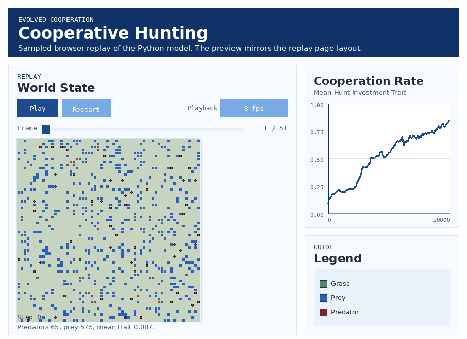
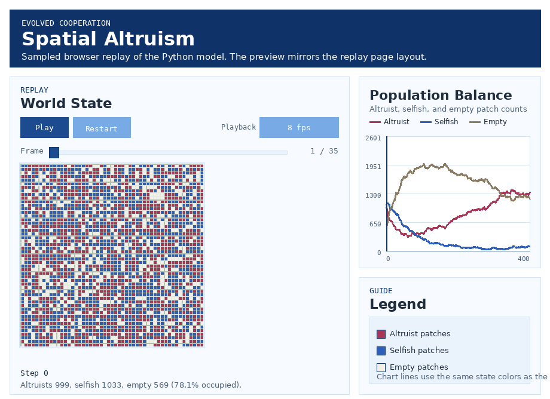

# EvolvedCooperation

A collection of agent-based models exploring cooperation, altruism, and
eco-evolutionary dynamics.

The current website-ready evolved-cooperation examples in this repo are:

- `spatial_altruism/`: a minimal spatial altruism model
- `cooperative_hunting/`: a spatial predator-prey-grass cooperative-hunting model

A third, simpler evolutionary model remains available in `cooperation/` as a
possible later website example.

## Environments
This repo uses a project-local Conda environment stored at `.conda/` so it travels with the workspace and VS Code can auto-select it.

- Interpreter path: `/home/doesburg/Projects/EvolvedCooperation/.conda/bin/python`
- VS Code setting: see `.vscode/settings.json` (we set `python.defaultInterpreterPath`, point VS Code at the local Conda executable, and use a repo-specific terminal profile instead of fixed-script launch entries)
- Matplotlib cache/config path for VS Code runs: `.vscode/.env` sets `MPLCONFIGDIR=.matplotlib`
- Ruff editor linting: install Ruff into the project environment with `./.conda/bin/python -m pip install ruff`
- Pylance note: `.vscode/settings.json` disables `reportMissingModuleSource` so compiled Matplotlib modules do not produce false-positive import warnings in editor diagnostics

### VS Code Run/Terminal behavior
The workspace is configured so VS Code uses the repo-local `.conda` deterministically:

1. `Terminal => New Terminal` opens `bash (.conda)`, which sources the normal shell startup and then activates `/home/doesburg/Projects/EvolvedCooperation/.conda`.
2. `Run => Run Without Debugging` uses `.vscode/launch.json` plus `.vscode/run_active_python.py` to inspect the active editor file.
3. If the active file lives inside a Python package in the repo, the helper runs it with module semantics (`runpy.run_module(...)`), which matches `python -m ...` from the repo root and satisfies module-only guards.
4. If the active file is not inside a package, the helper falls back to normal script execution (`runpy.run_path(...)`).
5. The launch config still forces `${workspaceFolder}/.conda/bin/python`, so runs do not depend on whichever interpreter VS Code happened to remember previously.

Activate the environment in a terminal when running commands manually:
```bash
source /home/doesburg/miniconda3/etc/profile.d/conda.sh
conda activate "$(pwd)/.conda"
# or run without activation using the interpreter directly:
./.conda/bin/python -m pip install -r requirements.txt
./.conda/bin/python -m spatial_altruism.altruism_model
```

If you see a “bad interpreter” error, regenerate entry scripts (pip, etc.) with:
```bash
./.conda/bin/python -m pip install --upgrade --force-reinstall pip setuptools wheel
```

## Current Focus

The most actively documented ecology model in the repo lives in
`cooperative_hunting/`.

- Main runtime: `cooperative_hunting/cooperative_hunting.py`
- Active parameters: `cooperative_hunting/config/cooperative_hunting_config.py`
- Detailed model notes and theory mapping:
  `cooperative_hunting/README.md`

Current mechanics in that model:

- predators carry a heritable continuous hunt investment trait `hunt_investment_trait in [0,1]`
- hunt contribution is `predator_energy * hunt_investment_trait`
- predator cooperation cost is paid directly as
  `predator_cooperation_cost_per_unit * hunt_investment_trait`
- the config file now uses descriptive canonical parameter names, while legacy
  short aliases remain accepted for backward compatibility
- optional plasticity has been removed from the active code path, so the stored
  trait is the value used for hunting and cost

Browser replay preview:

[](https://doesburg11.github.io/EvolvedCooperation/cooperative-hunting/)

Click the full-window animation preview to open the GitHub Pages replay viewer.

## Website Landing Page Note

On 2026-04-06, the repo-level website root was turned into a multi-demo landing page.

Stepwise impact:

1. `docs/index.html` now acts as a landing page that lists the available replay demos instead of embedding one specific simulation.
2. The cooperative-hunting browser replay now lives at `docs/cooperative-hunting/index.html`.
3. The spatial-altruism browser replay continues to live at `docs/spatial-altruism/index.html`.
4. README links now point directly to each demo route instead of assuming the root site always hosts the cooperative-hunting replay.

## Landing Page Feedback Loop Note

On 2026-04-10, the landing page gained a conceptual display that clarifies the eco-evolutionary feedback loop around learning and plasticity.

Stepwise impact:

1. `docs/index.html` now includes a full-width `Why the feedback loop matters` section beneath the demo cards.
2. The new display presents the loop as a four-step sequence: evolution shapes learning capacities, learning reshapes ecological structure, ecological structure reshapes selection gradients, and plasticity closes the loop.
3. The landing page now also contrasts unstable and stable environments so the selection logic behind higher versus lower plasticity is visible at a glance.
4. `docs/style.css` now includes responsive home-page styles for that explanatory display while staying in the existing card-based visual system.

## GitHub Pages Deployment Note

On 2026-04-06, the repo gained an explicit GitHub Pages deployment workflow for the interactive viewers.

Stepwise impact:

1. `.github/workflows/deploy-pages.yml` now publishes the repo-level `docs/` site on pushes to `main`.
2. `docs/index.html` now labels both demo entry points as `Open Interactive Viewer` so the viewer routes are explicit.
3. The public routes remain `docs/cooperative-hunting/index.html` and `docs/spatial-altruism/index.html`; the workflow only changes how those pages are deployed.
4. If the repository Pages setting is not already using `GitHub Actions`, switch it there so this workflow becomes the active publisher.

Project convention for this model:

- prefer editing parameters inside the config file rather than passing CLI
  parameter overrides
- run from repo root with `./.conda/bin/python`

Minimal run example:
```bash
./.conda/bin/python -m cooperative_hunting.cooperative_hunting
```

## Website Roadmap

Current website examples under evolved cooperation:

- `Spatial Altruism` -> `spatial_altruism/altruism_model.py`
- `Cooperative Hunting` -> `cooperative_hunting/cooperative_hunting.py`

Strong next candidate for later addition:

- `Cooperative vs Greedy Grazing` -> `cooperation/cooperation_model.py`

## Cooperative Hunting Rename Note

On 2026-04-06, the package directory for the predator-prey-grass model was renamed from `predpreygrass_cooperative_hunting/` to `cooperative_hunting/`.

Stepwise impact:

1. The Python package now lives at `cooperative_hunting/`.
2. Module entrypoints now use `./.conda/bin/python -m cooperative_hunting...` from the repo root.
3. Internal asset paths moved from `assets/predprey_cooperative_hunting/` to `assets/cooperative_hunting/`.
4. Utility output paths now write to `cooperative_hunting/images/`.
5. The package rename initially affected the Python/package layer; the public viewer route was renamed separately on 2026-04-07.

## Public Viewer Rename Note

On 2026-04-07, the cooperative-hunting browser viewer and website slug were renamed from `predator-prey-cooperative-hunting` to `cooperative-hunting`.

Stepwise impact:

1. The repo-level replay page moved from `docs/predator-prey-cooperative-hunting/index.html` to `docs/cooperative-hunting/index.html`.
2. GitHub Pages links now point to `/cooperative-hunting/`.
3. The `humanbehaviorpatterns.org` page and replay paths now use `/evolved-cooperation/cooperative-hunting/`.
4. The public viewer title and landing-page label now read `Cooperative Hunting`, while the descriptive copy still explains that it is a predator-prey-grass ecology.

## Models

### Spatial Altruism
- **Description:** Patch-based grid simulation of altruism vs selfishness, ported from NetLogo to Python/NumPy.
- **Browser replay preview:**

[](https://doesburg11.github.io/EvolvedCooperation/spatial-altruism/)

- **Features:**
	- Each cell can be empty (black), selfish (green), or altruist (pink)
	- Simulates benefit/cost of altruism, fitness, and generational updates
	- Fully vectorized NumPy implementation for fast simulation
	- Pygame UI for interactive exploration
	- Matplotlib plots for population dynamics
	- Grid search for parameter sweeps
	- Sampled browser replay and README GIF preview
- **Files:**
	- `spatial_altruism/altruism_model.py`: Core simulation logic
	- `spatial_altruism/altruism_pygame_ui.py`: Pygame-based interactive UI
	- `spatial_altruism/config/altruism_config.py`: Active runtime configuration
	- `spatial_altruism/config/altruism_website_demo_config.py`: Frozen website replay configuration
	- `spatial_altruism/images/`: Plotting scripts and generated image or Plotly outputs
	- `spatial_altruism/utils/export_github_pages_demo.py`: Website replay and preview GIF exporter
	- `spatial_altruism/utils/altruism_grid_search.py`: Parallel grid search for extended coexistence sweeps
	- `spatial_altruism/data/grid_search_results_extended.csv`: Results from the parallel grid search
- **Usage:**
	- Run core model:
		```bash
		# edit spatial_altruism/config/altruism_config.py first if needed
		./.conda/bin/python -m spatial_altruism.altruism_model
		```
	- Run Pygame UI:
		```bash
		./.conda/bin/python -m spatial_altruism.altruism_pygame_ui
		```
	- Run grid search:
		```bash
		./.conda/bin/python -m spatial_altruism.utils.altruism_grid_search
		```
	- Regenerate website replay bundle:
		```bash
		./.conda/bin/python -m spatial_altruism.utils.export_github_pages_demo
		```
- **Requirements:**
	- Python 3.8+
	- numpy
	- pygame (for UI)
	- matplotlib (for plotting)
	- torch (for surface fitting)

### Cooperative vs Greedy Grazing
- **Description:** Evolutionary model of greedy vs cooperative cows competing for regrowing grass.
- **Features:**
	- Agents move, eat, reproduce, and die based on energy and grass availability
	- Cooperative cows avoid eating low grass, greedy cows eat regardless
	- Grass regrows at different rates depending on height
	- Pygame UI for visualization
- **Files:**
	- `cooperation/cooperation_model.py`: Core simulation logic
	- `cooperation/cooperation_pygame_ui.py`: Pygame-based interactive UI
	- `cooperation/Cooperation.nlogox`: Original NetLogo model
- **Usage:**
	- Run CLI demo:
		```bash
		./.conda/bin/python cooperation/cooperation_model.py
		```
	- Run Pygame UI:
		```bash
		./.conda/bin/python cooperation/cooperation_pygame_ui.py
		```
- **Requirements:**
	- Python 3.8+
	- numpy
	- pygame
	- matplotlib

### Cooperative Hunting
- **Description:** Spatial predator-prey ecology where predators evolve a
  continuous cooperation trait that affects group hunting success, payoff
  sharing, and private cooperation cost.
- **Files:**
	- `cooperative_hunting/cooperative_hunting.py`: core simulation and runtime entry point
	- `cooperative_hunting/config/cooperative_hunting_config.py`: active runtime parameters
	- `cooperative_hunting/utils/matplot_plotting.py`: Matplotlib plotting helpers for baseline runs
	- `cooperative_hunting/utils/sweep_dual_parameter.py`: parameter sweep tooling
	- `cooperative_hunting/utils/tune_mutual_survival.py`: coexistence tuning utilities
	- `cooperative_hunting/README.md`: detailed interpretation and experiment guide
- **Usage:**
	- Edit parameters in `cooperative_hunting/config/cooperative_hunting_config.py`
	- Run:
		```bash
		./.conda/bin/python -m cooperative_hunting.cooperative_hunting
		```
- **Current status:**
	- uses raw inherited `hunt_investment_trait` directly for hunt effort and cooperation cost
	- supports equal-split or contribution-weighted prey sharing
	- includes headless analysis, pygame live rendering, and sweep/tuning helpers

## Installation
Install dependencies:
```bash
pip install numpy pygame matplotlib torch
```
For Pygame visualization, you may need:
```bash
conda install -y -c conda-forge gcc=14.2.0
```

## References
- Original NetLogo models from Uri Wilensky and the EACH unit (Evolution of Altruistic and Cooperative Habits)
- See `spatial_altruism/README.md` and `cooperation/Cooperation.nlogox` for more details
