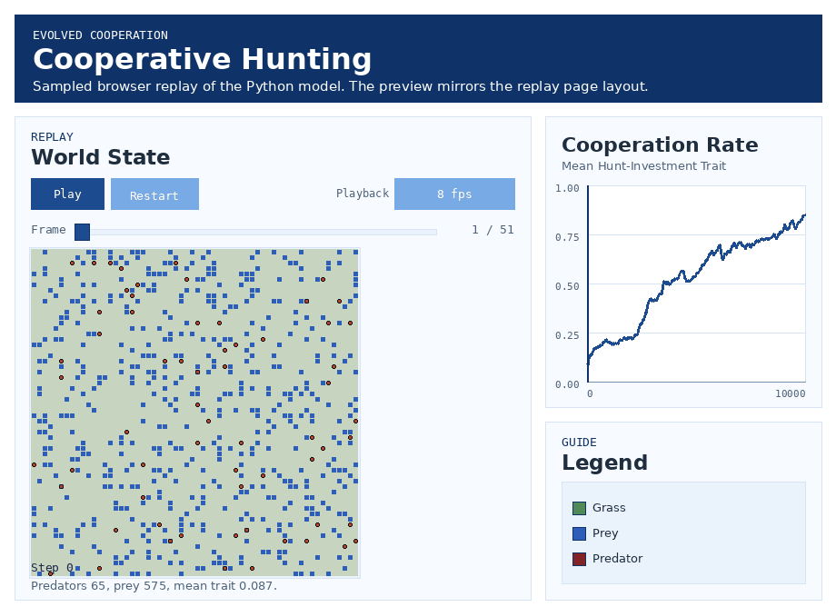
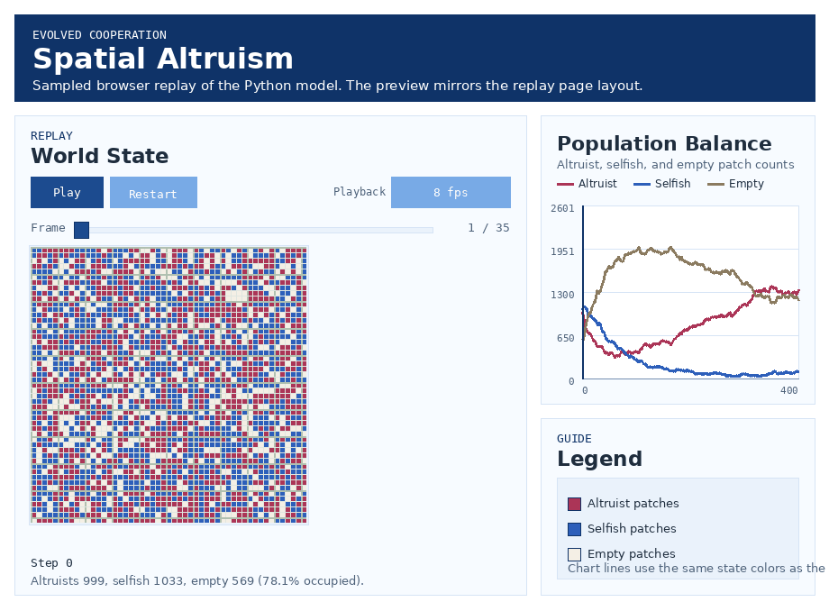

# EvolvedCooperation

A collection of agent-based models exploring cooperation, altruism, and eco-evolutionary dynamics.

The current evolved-cooperation examples in this repo are:

- `ecological_models/spatial_altruism/`: a minimal spatial altruism model
- `ecological_models/cooperative_hunting/`: a spatial predator-prey-grass cooperative-hunting model
- `ecological_models/spatial_prisoners_dilemma/`: a spatial Prisoner's Dilemma ecology with local play, movement, reproduction, and inherited same-vs-other strategy encodings
- `ecological_models/retained_benefit/`: a lattice model that tests how much cooperative benefit
  must be routed back toward cooperators or their copies before cooperation can
  spread

Additional experimental module in this repo:

- `top_down_model/`: an integrated human-cooperation model with reputation,
  norms, band territory, kin/spouse/household structure, local movement, child
  rearing, and density ecology in one demographic simulation
- `moran_models/interaction_kernel/`: a general interaction-kernel engine with explicit
	positive/negative routing and pluggable selection dynamics that can be used
	to instantiate mechanisms such as kin selection
- `moran_models/nowak_mechanisms/direct_reciprocity/scaffolds/`: direct-reciprocity
  scaffold experiments, including discrete spatial clustering and continuous
  spatial partner-memory routing

## Cross-Repo Mapping

`EvolvedCooperation` contains the canonical Python implementations for
website-facing cooperation models where cooperation changes through evolutionary
dynamics alone. Lifetime learning is intentionally out of scope here and is
handled in the companion repositories `LearnedCooperation` and
`EvolvedAndLearnedCooperation`.

The cooperation model repositories are separated by mechanism:

- `EvolvedCooperation`: evolutionary dynamics only; lifetime learning is out of scope.
- `LearnedCooperation`: lifetime learning only; evolutionary change is out of scope.
- `EvolvedAndLearnedCooperation`: coupled evolutionary and lifetime-learning dynamics.

The public website `https://humanbehaviorpatterns.org/` is built from the
sibling `human-cooperation-site` repo, so the matching website pages should
stay faithful to the Python implementations here.

For detailed cross-repo mapping and repository maintenance notes, see
`AGENTS.md`.

## Environments
This repo uses a project-local Conda environment stored at `.conda/` so it travels with the workspace and VS Code can auto-select it.

- Interpreter path: `/EvolvedCooperation/.conda/bin/python`
- VS Code setting: see `.vscode/settings.json` (we set `python.defaultInterpreterPath`, point VS Code at the local Conda executable, and use a repo-specific terminal profile instead of fixed-script launch entries)
- Matplotlib cache/config path for VS Code runs: `.vscode/.env` sets `MPLCONFIGDIR=.matplotlib`
- Ruff editor linting: install Ruff into the project environment with `./.conda/bin/python -m pip install ruff`
- Pylance note: `.vscode/settings.json` disables `reportMissingModuleSource` so compiled Matplotlib modules do not produce false-positive import warnings in editor diagnostics

### VS Code Run/Terminal behavior
The workspace is configured so VS Code uses the repo-local `.conda` deterministically:

1. `Terminal => New Terminal` opens `bash (.conda)`, which sources the normal shell startup and then activates `/EvolvedCooperation/.conda`.
2. `Run => Run Without Debugging` uses `.vscode/launch.json` plus `.vscode/run_active_python.py` to inspect the active editor file.
3. If the active file lives inside a Python package in the repo, the helper runs it with module semantics (`runpy.run_module(...)`), which matches `python -m ...` from the repo root and satisfies module-only guards.
4. If the active file is not inside a package, the helper falls back to normal script execution (`runpy.run_path(...)`).
5. The launch config still forces `${workspaceFolder}/.conda/bin/python`, so runs do not depend on whichever interpreter VS Code happened to remember previously.


## Current Focus

The most actively documented ecology model in the repo lives in
`ecological_models/cooperative_hunting/`.

- Main runtime: `ecological_models/cooperative_hunting/cooperative_hunting.py`
- Active parameters: `ecological_models/cooperative_hunting/config/cooperative_hunting_config.py`
- Detailed model notes and theory mapping:
  `ecological_models/cooperative_hunting/README.md`

Current mechanics in that model:

- predators carry a heritable continuous hunt investment trait `hunt_investment_trait in [0,1]`
- hunt contribution is `predator_energy * hunt_investment_trait`
- predator cooperation cost is paid directly as
  `predator_cooperation_cost_per_unit * hunt_investment_trait`
- the config file now uses descriptive canonical parameter names, while legacy
  short aliases remain accepted for backward compatibility
- optional plasticity has been removed from the active code path, so the stored
  trait is the value used for hunting and cost

Browser replay preview:

[](https://doesburg11.github.io/EvolvedCooperation/cooperative-hunting/)

Click the full-window animation preview to open the GitHub Pages replay viewer.

Project convention for this model:

- run from repo root with `./.conda/bin/python`

Minimal run example:
```bash
./.conda/bin/python -m ecological_models.cooperative_hunting.cooperative_hunting
```

## Cross-Model Synthesis

Taken together, the four current website-facing evolved-cooperation modules do
not support a strong claim that cooperation simply appears by default. They
support a more specific claim: cooperation persists only when the update rules
and ecology give cooperators some protection against immediate exploitation.

A useful near-universal formulation is: cooperation evolves when the benefits
created by cooperation flow back to cooperators, or to copies of the
cooperative rule, strongly enough to outweigh the private cost. In shorthand:
there is no cooperation without feedback.

The `ecological_models/retained_benefit/` module is the repo's most direct attempt to test
that claim in a deliberately abstract form.

Shared pattern across the current models:

1. There must be heritable variation in a cooperative trait or strategy.
2. Interactions must be local enough that cooperative benefits are not spread
   completely at random.
3. Some feedback mechanism must return enough of the cooperative benefit back
   toward cooperators.
4. Reproduction and turnover must allow successful local structures to spread.
5. The private cost of cooperation must stay low enough relative to the
   protected benefit.

The four modules implement that protection in different ways:

- `ecological_models/spatial_altruism/`: local clustering plus void competition and disturbance
  can support altruist-selfish coexistence
- `ecological_models/spatial_prisoners_dilemma/`: conditional reciprocity can outperform pure
  defection, but it still yields coexistence rather than universal cooperation
- `ecological_models/cooperative_hunting/`: costly cooperation can pay when coordinated hunting
  creates real synergy, but the current active baseline is a supported-start
  threshold-synergy case rather than a pure de novo emergence test
- `ecological_models/retained_benefit/`: cooperation rises only when enough of the benefit it
  creates is routed back toward cooperators or their copies rather than leaking
  broadly to free-riders

Mapping the current models onto Nowak's five canonical mechanisms:

| Model | Primary Nowak mechanism | Secondary or adjacent | Not implemented |
| --- | --- | --- | --- |
| `ecological_models/spatial_altruism/` | Network reciprocity | Group-selection-adjacent spatial patch effects | Direct reciprocity, indirect reciprocity, explicit kin selection |
| `ecological_models/spatial_prisoners_dilemma/` | Direct reciprocity and network reciprocity | Local assortment through lattice position | Indirect reciprocity, explicit kin selection, explicit group reproduction |
| `ecological_models/cooperative_hunting/` | Not a clean single Nowak mechanism | Network reciprocity, byproduct mutualism, partner-like ecological feedback | Reputation-based indirect reciprocity, explicit kin selection |
| `ecological_models/retained_benefit/` | Generalized assortment and feedback | Kin-selection-like lineage routing, network reciprocity through local neighborhoods | Memory-based direct reciprocity, reputation-based indirect reciprocity |
| `moran_models/interaction_kernel/` | General engine, not a single mechanism | Kin-weighted routing, network-local routing, mixed help-harm | Mechanism-specific memory and reputation unless added as wrappers |

The five explicit Moran wrappers for Nowak's mechanisms live under `moran_models/nowak_mechanisms/`.
The additional `direct_reciprocity/scaffolds/` packages are direct-reciprocity
scaffold examples rather than pure well-mixed baselines.

For emergence from rarity, the mechanisms differ in fundamentality because they
create positive assortment in different ways. The useful ordering is:

1. **Kin selection** — genetic relatedness can favor helping from the start when
   enough benefit returns to copies of the cooperative rule.
2. **Network reciprocity** — spatial or graph clustering protects cooperative
   neighborhoods.
3. **Group selection** — group boundaries and between-group competition can
   favor cooperative groups despite within-group free riding.
4. **Indirect reciprocity** — reputation can scale cooperation among non-kin,
   but it requires observation, assessment, and memory.
5. **Direct reciprocity** — repeated interaction is strongest as amplification
   and maintenance; pure direct reciprocity has the hardest startup problem.

This is not a claim that kin selection is always the only or largest mechanism
in real systems. It is a claim about de novo emergence: kin, network, and group
mechanisms supply assortment earlier, while indirect and direct reciprocity need
more social-information or partner-history structure before they become reliable.

### 2026-05-08 Moran Emergence Baseline Check

The non-direct Nowak wrappers were tested in isolation with:

```bash
./.conda/bin/python -m moran_models.interaction_kernel.utils.compare_emergence_baselines
```

Stepwise impact:

1. The new utility compares indirect reciprocity, network reciprocity, group
   selection, and kin selection from the same low-start condition.
2. The run used initial mean cooperation trait about `0.119`,
   `B_plus_scale = [0.8, 1.0, 1.2]`, `C_scale = [0.10, 0.20, 0.30]`,
   eight seeds per cell, and 250 steps.
3. Emergence success means final mean trait at least `0.50` and a gain of at
   least `0.05` from the low start.
4. Indirect reciprocity succeeded in all 9 tested cells under the current
   reputation-weighted implementation.
5. Kin selection succeeded fully in 2 cells and partially in 3 more; network
   reciprocity and group selection each succeeded fully in 1 cell and partially
   in 2 more.
6. Network and group selection were strongly cost-thresholded, while kin
   selection retained more intermediate growth at moderate cost.

Artifacts:

- `moran_models/interaction_kernel/data/compare_emergence_baselines_20260508_134242_summary.csv`
- `moran_models/interaction_kernel/data/compare_emergence_baselines_20260508_134242_replicates.csv`
- `moran_models/interaction_kernel/data/compare_emergence_baselines_20260508_134242_summary.txt`

So the strongest repo-level conclusion at this stage is modest:

- the minimal conditions are not one magic parameter, but a bundle of
  assortment, feedback, inheritance, and a favorable cost-benefit ratio
- without such protection, selfish behavior usually wins
- with it, cooperation can persist, spread, or coexist, depending on the
  mechanism
- these models are mechanism-level demonstrations, not a universal law of the
  evolution of cooperation

## Models

### Top-Down Cooperation Model
- **Description:** Integrated population model that gives agents reputation
  sensitivity, norm enforcement, band identity, kin recognition, spouse bonds,
  households, child rearing, spatial awareness, and direct-reciprocity bond
  fidelity at the same time. The model is now oriented toward a more realistic
  hunter-gatherer starting point rather than a strict abstract Nowak-mechanism
  decomposition.
- **Files:**
	- `top_down_model/top_down_model.py`: core runtime, interaction routing, demographic update, and summary output
	- `top_down_model/config/top_down_config.py`: active runtime parameters and proof scenarios
	- `top_down_model/utils/live_viewer.py`: Pygame scatter viewer for spatial position, trait color, band color, reciprocity bonds, and summary metrics
	- `top_down_model/utils/proof_of_mechanism.py`: scenario proof utility for the integrated model
- **Usage:**
	- Edit parameters in `top_down_model/config/top_down_config.py`
	- Run:
		```bash
		./.conda/bin/python -m top_down_model.top_down_model
		```
	- Run live viewer:
		```bash
		./.conda/bin/python -m top_down_model.utils.live_viewer
		```
- **Current status:**
	- cooperation is represented by a continuous inherited `helping_trait`
	- the viewer separates mean helping trait from the frequency above the
	  invasion threshold, so `Trait >= 0.10 = 100%` can coexist with a mean trait
	  near `0.25`
	- the viewer now also reports realized help: the fraction of actual helping
	  opportunities in the latest step that produced help
		- `group_id` now stores concrete band membership: bands have territory
		  centers, weak member attraction, migration, fission/fusion,
		  inter-band marriage, and inter-band conflict
		- life history now separates dependent juveniles, non-reproductive
		  subadults, reproductive adults, and elders; default biological adulthood
		  starts at age `18`
		- agents now move during life through a stage-specific local random walk, so
		  spatial neighborhoods change through both movement and birth/death turnover
	- child rearing is now explicit: adults and elders can invest costly care in
	  nearby juveniles, with parent and kin relatedness biasing who receives care
	- reproductive co-parents can form persistent spouse bonds; spouse bonds can
	  bias repeat mating, seed local reciprocity bonds, and strengthen care for
	  shared nearby children
		- households now act as co-resident family/camp units with a residence point;
		  members are pulled toward that residence, juveniles can receive a household
		  survival bonus from living parents and adult caregivers, and maturing
		  juveniles can disperse into new households
		- local grass is now explicit: adults and elders harvest from nearby grass
		  cells instead of receiving guaranteed adult food energy, and parents can
		  pass surplus harvested food to their own nearby juveniles
		- reciprocity bonds are spatially local: new bonds form only within the
		  configured formation radius, and existing bonds dissolve if movement
		  carries bondmates beyond the configured dissolution radius
		- population regulation now uses soft density pressure rather than a hard
		  random trim to exactly the target population

#### 2026-05-15 Top-Down Grass Foraging and Parent Food Update

Stepwise impact:

1. `top_down_model/config/top_down_config.py` now defines a local grass ecology:
   `grass_grid_size`, `grass_max_per_cell`, `grass_initial_fraction`,
   `grass_regrowth_per_step`, and `grass_harvest_radius`.
2. `top_down_model/top_down_model.py` now initializes a toroidal grass grid and
   regrows grass each step before foraging.
3. Subadult, adult, and elder `*_foraging_energy_gain` parameters now act as
   maximum grass harvest per step. They are no longer unconditional energy added
   from nowhere.
4. Harvesting uses a local radius around the forager, so clustered households can
   deplete nearby grass even when grass elsewhere in the world remains available.
5. Parents then keep an energy reserve
   (`parent_food_transfer_energy_reserve`) and distribute surplus food up to
   `parent_food_transfer_capacity` to their own juvenile children within
   `parent_food_transfer_radius`.
6. Parent food allocation is weighted by proximity and by shared household
   membership through `parent_food_transfer_household_weight_bonus`.
7. The kin/household ablation now disables parent surplus feeding by setting
   `parent_food_transfer_capacity` to `0`, while grass itself remains part of the
   background ecology.
8. The model now records `mean_grass_fraction`, `grass_harvest`,
   `parent_food_transfer`, `fed_juvenile_count`, and
   `fed_juvenile_fraction`.
9. `top_down_model/utils/live_viewer.py` now supports `g` for the grass
   background and reports grass availability, harvested grass, and food passed
   to juveniles in the side panel.

#### 2026-05-15 Top-Down Food Survival and Fertility Tuning Update

Stepwise impact:

1. `top_down_model/config/top_down_config.py` now defines
   `juvenile_food_survival_benefit`,
   `juvenile_food_survival_saturation`, and
   `juvenile_no_food_survival_penalty`.
2. Juvenile survival in `top_down_model/top_down_model.py` now includes a
   saturating food term from actual parent food received in the current step.
   Fed juveniles receive a survival boost; unfed juveniles receive a small
   penalty.
3. The model now records `mean_juvenile_food_survival_effect`, so the net
   survival contribution of parent feeding is visible in history and summaries.
4. Parent provisioning was retuned to be visible under the longer childhood:
   `parent_food_transfer_capacity = 0.90`,
   `parent_food_transfer_energy_reserve = 6.0`, and
   `parent_food_transfer_radius = 24.0`.
5. Fertility and energetic thresholds were retuned after adding human-length
   childhood: `female_reproduction_probability = 0.90`,
   `reproduction_energy_threshold = 3.5`, `reproduction_energy_cost = 0.6`,
   and `child_energy = 4.0`.
6. Adult and elder grass harvest ceilings were increased to `0.40` and `0.24`
   respectively so adults can support replacement under local resource
   depletion.
7. `base_juvenile_survival_probability` is now `0.88`; food and care still
   modulate survival, but the baseline no longer collapses just because children
   remain dependent longer.
8. `top_down_model/top_down_model.py` now records stage counts:
   `juvenile_count`, `subadult_count`, `adult_count`, and `elder_count`.
9. `top_down_model/utils/live_viewer.py` now reports stage composition as
   `Stages J/S/A/E` and shows the latest food survival effect as `Food surv`.

#### 2026-05-15 Top-Down Fed-Juvenile Overlay Update

Stepwise impact:

1. `top_down_model/utils/live_viewer.py` now has a separate fed-juvenile overlay
   controlled by `f`.
2. The existing `c` control still toggles gold child-care rings only.
3. Juveniles that received parent food in the latest step now receive a cyan
   ring, scaled by food amount.
4. Care and food can now be inspected independently, so alloparental care and
   parent provisioning are no longer visually conflated.
5. The viewer legend now distinguishes `Gold ring = received care this step`
   from `Cyan ring = received parent food`.

#### 2026-05-15 Top-Down Viewer Chart Layout Update

Stepwise impact:

1. `top_down_model/utils/live_viewer.py` now places the readable legend in the
   lower-left of the side panel.
2. The viewer window and side panel are wider, so charts can sit to the right of
   the legend instead of forcing compact labels.
3. The existing mean-helping-trait chart now sits at the top of the right-side
   chart stack.
4. `top_down_model/top_down_model.py` now records per-band population counts
   as `band_<id>_count`, with dynamic IDs when fission creates new bands.
5. `top_down_model/utils/live_viewer.py` now draws a second chart for band
   sizes beneath the mean-helping-trait chart, using the band colors as line
   colors.
6. The legend keeps readable labels such as `Band 0`,
   `Gold ring = received care this step`, `Cyan ring = received parent food`,
   and `Square = household residence`.

#### 2026-05-15 Top-Down Band Territory and Fission/Fusion Update

Stepwise impact:

1. `top_down_model/top_down_model.py` now adds explicit `Band` objects with
   territory centers and territory radii. The existing `group_id` individual
   field is retained as the storage slot for band membership.
2. `n_groups` now seeds the initial number of bands instead of only defining
   abstract color groups.
3. Founder families are initialized around band territories, so the starting
   population has spatially concrete residential bands from step `0`.
4. Movement now includes a weak attraction toward the individual's band
   territory through `band_member_attraction`, in addition to the existing
   household residence attraction.
5. Band territory centers update toward their current subadult/adult/elder
   members through `band_territory_update_weight`, so bands can move as their
   members move.
6. `group_migration_probability` is now interpreted as per-step individual
   migration between bands for agents at least `band_migration_min_age`, rather
   than random newborn group reassignment.
7. Large bands can fission using `band_fission_interval`,
   `band_fission_size_threshold`, `band_fission_min_size`, and
   `band_fission_dispersal_std`; small bands can fuse with nearby bands using
   `band_fusion_interval`, `band_fusion_size_threshold`, and
   `band_fusion_distance`.
8. Mate choice now includes inter-band marriage: different-band fathers receive
   an additional mate-choice weight when the two bands or the two individuals
   are close enough under `interband_marriage_distance`.
9. When an inter-band spouse joins the mother's household, the father migrates
   into the mother's band, making marriage a migration pathway as well as a
   reproduction pathway.
10. Spouse bonds are now stable while both spouses are alive, so births no
    longer constantly overwrite living spouse bonds. The inter-band marriage
    counter increments only when a new cross-band spouse bond forms.
11. The model now records `band_count`, `mean_band_size`, `band_migrations`,
    `band_fissions`, `band_fusions`, `interband_marriages`, and dynamic
    `band_<id>_count` histories, plus cumulative totals for migration,
    fission, fusion, and inter-band marriage.
12. `top_down_model/utils/live_viewer.py` now labels these identities as
    bands, draws optional band territory outlines with `t`, reports band event
    counters, and plots dynamic band-size histories.

#### 2026-05-15 Top-Down Human Age-Structure Update

Stepwise impact:

1. `top_down_model/config/top_down_config.py` now replaces the compressed
   `juvenile_maturity_age = 5` life history with `juvenile_dependency_age = 12`
   and `adult_maturity_age = 18`.
2. `top_down_model/top_down_model.py` now has a fourth life stage,
   `subadult`, for ages between dependent childhood and biological adulthood.
3. Default stage ranges are now: juvenile `0-11`, subadult `12-17`, adult
   `18-54`, and elder `55-84`.
4. Female reproduction now starts at age `18`, and male reproduction now starts
   at age `20`, so age `5-6` agents can no longer reproduce.
5. Founder adults now start between ages `18` and `36`, and initial dependent
   children now start between ages `0` and `11`.
6. Subadults can move, remain attached to households, survive with their own
   stage probability, and harvest grass at a lower rate than adults.
7. Subadults do not reproduce, do not provide full child-care investment, and do
   not count as adult/elder anchors for household residence updates.
8. Adult household dispersal now happens when a juvenile/subadult first becomes
   an adult at `adult_maturity_age`.
9. `top_down_model/utils/live_viewer.py` now renders subadults as an
   intermediate dot size between dependent juveniles and adults.
10. Under the fertility retuning above, `no_kin_selection` remains
    demographically viable; it disables kin, spouse, household, child-care, and
    parent-food channels without making population collapse the expected result.

#### 2026-05-15 Top-Down Household Ecology Update

Stepwise impact:

1. `top_down_model/top_down_model.py` now has explicit `Household` objects and
   every individual carries a `household_id`.
2. Founder pairs start in the same household, and each household has a residence
   point that updates toward its adult/elder members.
3. Movement now combines individual random walk with stage-specific attraction
   toward the household residence, making co-residence a spatial mechanism.
4. Reproductive children inherit the mother's household. When a spouse bond is
   formed or refreshed, the father can join the mother's household through
   `spouse_household_join_probability`.
5. Juvenile survival now includes a household bonus from living parents and
   adult/elder household caregivers, in addition to direct child-care
   investment.
6. Maturing juveniles can disperse and found a new household through
   `maturity_new_household_probability` and
   `maturity_household_dispersal_std`.
7. Household membership also biases child-care allocation through
   `child_rearing_household_member_weight_bonus`.
8. The live viewer now supports `h` for household residence centers and reports
   household count, average household size, and latest household survival bonus.

#### 2026-05-15 Top-Down Spouse-Bond and Care-Overlay Update

Stepwise impact:

1. `top_down_model/config/top_down_config.py` now makes child rearing more
   visible by lowering `base_juvenile_survival_probability` from `0.92` to
   `0.88` and increasing the maximum care survival benefit from `0.08` to
   `0.12`.
2. Individuals now store `spouse_id`, a persistent co-parent pair bond separate
   from the direct-reciprocity `reciprocity_bond_id`.
3. Initial founder pairs are placed near each other, form spouse bonds, and can
   seed local reciprocity bonds if both are unbonded and within the configured
   spouse-reciprocity radius.
4. Reproduction now forms or refreshes a spouse bond between the mother and
   father. Existing spouses are weighted upward in mate choice through
   `spouse_mate_preference`.
5. Spouse reciprocity bonds now get a higher persistence floor while the
   spouses remain local, so co-parent reciprocity can be maintained but still
   dissolves if distance or bond history breaks it.
6. Child-care allocation now gives extra weight when the helper's spouse is
   also the juvenile's parent, and another bonus when both co-parents are near
   the juvenile.
7. The model now records spouse-pair counts, spouse reciprocity counts, cared
   juvenile counts, and spouse/coparent contributions to child care.
8. `top_down_model/utils/live_viewer.py` now supports `s` for spouse-bond lines
   and `c` for the cared-juvenile overlay. The overlay draws a gold ring around
   juveniles that received care in the latest step.

#### 2026-05-15 Top-Down Child-Rearing Update

Stepwise impact:

1. `top_down_model/config/top_down_config.py` now defines child-rearing
   parameters under the kin-selection capacity, including care radius, helper
   care capacity, care cost, caregiver energy reserve, juvenile survival
   benefit, saturation, and parent/kin allocation weights.
2. `top_down_model/top_down_model.py` now lets adults and elders provide
   costly care to nearby juveniles before the survival pass.
3. Care recipient choice is local first, then biased by pedigree: parents get
   the strongest allocation bonus, other recognized kin get a smaller bonus,
   and non-kin juveniles can still receive low-baseline alloparental care.
4. Juvenile survival now uses the configured base juvenile survival probability
   plus a saturating care bonus, then applies the existing soft density
   survival pressure.
5. The model now records `juvenile_survival_rate`,
   `total_child_rearing_care`, `mean_child_rearing_care`,
   `mean_child_rearing_relatedness`, `kin_child_rearing_fraction`, and
   `parent_child_rearing_fraction`.
6. The live viewer now displays latest child-care investment and juvenile
   survival, so child rearing is visible as a demographic mechanism rather
   than being conflated with reciprocity bonds or mating.

#### 2026-05-15 Top-Down Reciprocity-Bond Rename

Stepwise impact:

1. The direct-reciprocity pair-bond concept is now named `reciprocity_bond`
   instead of `partner` in the top-down Python model and viewer.
2. `top_down_model/config/top_down_config.py` now uses
   `reciprocity_bond_persistence_probability`,
   `reciprocity_bond_formation_radius`, and
   `reciprocity_bond_dissolution_radius`.
3. `top_down_model/top_down_model.py` now stores
   `reciprocity_bond_id` and `reciprocity_bond_memory` on each individual.
4. The history metric formerly called `mean_partner_memory` is now
   `mean_reciprocity_bond_memory`.
5. The live viewer labels these lines and controls as reciprocity bonds, making
   clear that they are direct-reciprocity social bonds rather than mating,
   group, kin, or reputation links.

#### 2026-05-15 Top-Down Local Reciprocity-Bond Update

Stepwise impact:

1. `top_down_model/config/top_down_config.py` now defines
   `reciprocity_bond_formation_radius` and
   `reciprocity_bond_dissolution_radius`.
2. `top_down_model/top_down_model.py` now uses toroidal spatial distance when
   managing direct-reciprocity bonds.
3. Newly unbonded adults can only form reciprocity bonds with adults within
   `reciprocity_bond_formation_radius`.
4. Existing bonds dissolve immediately when bondmates drift beyond
   `reciprocity_bond_dissolution_radius`, in addition to the existing bond-memory
   dissolution rule.
5. The live viewer now draws reciprocity bonds as shortest wrapped torus segments,
   so local bondmates near opposite world edges no longer appear connected by a
   full-canvas line.

#### 2026-05-15 Top-Down Lifetime Movement Update

Stepwise impact:

1. `top_down_model/config/top_down_config.py` now defines
   `juvenile_movement_step_std`, `adult_movement_step_std`, and
   `elder_movement_step_std`.
2. `top_down_model/top_down_model.py` now moves every living individual once
   per step after age and energy updates, before spatial interaction routing
   and mate choice are evaluated.
3. Movement is a local Gaussian random walk on the existing toroidal world, so
   agents wrap around the space edges instead of leaving the simulation area.
4. Juveniles move fastest, subadults remain fairly mobile, adults move
   moderately, and elders move slowest under the default config.
5. The live viewer now shows real model movement because `x` and `y` positions
   change during lifetime, not only when new offspring are born.

#### 2026-05-15 Top-Down Viewer and Density Update

Stepwise impact:

1. `top_down_model/utils/live_viewer.py` now labels the threshold statistic as
   `Trait >= 0.10` instead of `Helpers >10%`, and the chart title now says
   `Mean helping trait over time`.
2. `top_down_model/top_down_model.py` now records `realized_helping_rate`,
   `helping_events`, and `helping_opportunities` from actual interaction
   events, making trait propensity and observed helping behavior distinct.
3. The viewer side panel now displays realized help rate and the raw
   help-event/opportunity count for the latest step.
4. `top_down_model/config/top_down_config.py` replaced the hard
   `max_population` cap with `density_target_population`,
   `density_reproduction_pressure`, and `density_survival_pressure`.
5. The core model no longer randomly removes every individual above 400 after
   reproduction. Crowding above the density target now reduces reproduction and
   survival probabilities, so population can fluctuate around the target rather
   than pinning exactly to it.

### Spatial Altruism
- **Description:** Patch-based grid simulation of altruism vs selfishness, ported from NetLogo to Python/NumPy.
- **Browser replay preview:**

[](https://doesburg11.github.io/EvolvedCooperation/spatial-altruism/)

- **Features:**
	- Each cell can be empty (black), selfish (green), or altruist (pink)
	- Simulates benefit/cost of altruism, fitness, and generational updates
	- Fully vectorized NumPy implementation for fast simulation
	- Pygame UI for interactive exploration
	- Matplotlib plots for population dynamics
	- Grid search for parameter sweeps
	- Sampled browser replay and README GIF preview
- **Files:**
	- `ecological_models/spatial_altruism/altruism_model.py`: Core simulation logic
	- `ecological_models/spatial_altruism/altruism_pygame_ui.py`: Pygame-based interactive UI
	- `ecological_models/spatial_altruism/config/altruism_config.py`: Active runtime configuration
	- `ecological_models/spatial_altruism/config/altruism_website_demo_config.py`: Frozen website replay configuration
	- `ecological_models/spatial_altruism/images/`: Plotting scripts and generated image or Plotly outputs
	- `ecological_models/spatial_altruism/utils/export_github_pages_demo.py`: Website replay and preview GIF exporter
	- `ecological_models/spatial_altruism/utils/altruism_grid_search.py`: Parallel grid search for extended coexistence sweeps
	- `ecological_models/spatial_altruism/data/grid_search_results_extended.csv`: Results from the parallel grid search
- **Usage:**
	- Run core model:
		```bash
		# edit ecological_models/spatial_altruism/config/altruism_config.py first if needed
		./.conda/bin/python -m ecological_models.spatial_altruism.altruism_model
		```
	- Run Pygame UI:
		```bash
		./.conda/bin/python -m ecological_models.spatial_altruism.altruism_pygame_ui
		```
	- Run grid search:
		```bash
		./.conda/bin/python -m ecological_models.spatial_altruism.utils.altruism_grid_search
		```
	- Regenerate website replay bundle:
		```bash
		./.conda/bin/python -m ecological_models.spatial_altruism.utils.export_github_pages_demo
		```
- **Requirements:**
	- Python 3.8+
	- numpy
	- pygame (for UI)
	- matplotlib (for plotting)
	- torch (for surface fitting)

### Cooperative Hunting
- **Description:** Spatial predator-prey ecology where predators evolve a
  continuous cooperation trait that affects group hunting success, payoff
  sharing, and private cooperation cost.
- **Files:**
	- `ecological_models/cooperative_hunting/cooperative_hunting.py`: core simulation and runtime entry point
	- `ecological_models/cooperative_hunting/config/cooperative_hunting_config.py`: active runtime parameters
	- `ecological_models/cooperative_hunting/utils/matplot_plotting.py`: Matplotlib plotting helpers for baseline runs
	- `ecological_models/cooperative_hunting/utils/sweep_dual_parameter.py`: parameter sweep tooling
	- `ecological_models/cooperative_hunting/utils/tune_mutual_survival.py`: coexistence tuning utilities
	- `ecological_models/cooperative_hunting/README.md`: detailed interpretation and experiment guide
- **Usage:**
	- Edit parameters in `ecological_models/cooperative_hunting/config/cooperative_hunting_config.py`
	- Run:
		```bash
		./.conda/bin/python -m ecological_models.cooperative_hunting.cooperative_hunting
		```
- **Current status:**
	- uses raw inherited `hunt_investment_trait` directly for hunt effort and cooperation cost
	- supports equal-split or contribution-weighted prey sharing
	- includes headless analysis, pygame live rendering, and sweep/tuning helpers

### Spatial Prisoner's Dilemma
- **Description:** Spatial Prisoner's Dilemma ecology inspired by the
  FLAMEGPU implementation from `zeyus-research/FLAMEGPU2-Prisoners-Dilemma-ABM`.
  Agents interact locally, move when isolated, reproduce into neighboring empty
  cells, and inherit mutable strategies.
- **Relation to the other evolved-cooperation models:**
	- relative to `ecological_models/spatial_altruism/`, this model adds explicit agents, energy budgets, pairwise Prisoner's Dilemma play, movement, and conditional reciprocity; `ecological_models/spatial_altruism/` is the simpler lattice model of altruist versus selfish site competition
	- relative to `ecological_models/cooperative_hunting/`, this model is more game-theoretic and less ecological: it has no prey, grass, hunt coalitions, or continuous cooperation trait
	- taken together, the three models form a progression from local altruist-benefit selection (`ecological_models/spatial_altruism/`), to local reciprocity and inherited response rules (`ecological_models/spatial_prisoners_dilemma/`), to ecological synergy in predator group hunting (`ecological_models/cooperative_hunting/`)
- **Files:**
	- `ecological_models/spatial_prisoners_dilemma/spatial_prisoners_dilemma.py`: core runtime, logging, and summary output
	- `ecological_models/spatial_prisoners_dilemma/config/spatial_prisoners_dilemma_config.py`: active runtime parameters
	- `ecological_models/spatial_prisoners_dilemma/config/spatial_prisoners_dilemma_website_demo_config.py`: frozen website replay configuration
	- `ecological_models/spatial_prisoners_dilemma/utils/matplot_plotting.py`: Matplotlib plotting helpers
	- `ecological_models/spatial_prisoners_dilemma/utils/export_github_pages_demo.py`: website replay exporter
	- `ecological_models/spatial_prisoners_dilemma/README.md`: detailed mechanism and adaptation notes
- **Usage:**
	- Edit parameters in `ecological_models/spatial_prisoners_dilemma/config/spatial_prisoners_dilemma_config.py`
	- Run:
		```bash
		./.conda/bin/python -m ecological_models.spatial_prisoners_dilemma.spatial_prisoners_dilemma
		```
	- Regenerate website replay bundle:
		```bash
		./.conda/bin/python -m ecological_models.spatial_prisoners_dilemma.utils.export_github_pages_demo
		```
- **Current status:**
	- preserves the intended spatial play, movement, reproduction, mutation, and culling logic from the external model family
	- uses smaller CPU-friendly defaults instead of the original CUDA-scale population sizes
	- now exports both JSON run logs for analysis and a sampled website replay bundle from a frozen public config
	- now maps to the `human-cooperation-site` page at `/evolved-cooperation/spatial-prisoners-dilemma/`

### Retained Benefit
- **Description:** Abstract lattice model that tests a general cooperation
  condition: cooperation spreads when enough of the value it creates is routed
  back toward cooperators, or copies of the cooperative rule, to offset its
  private cost.
- **Relation to the other evolved-cooperation models:**
	- compared with `ecological_models/spatial_altruism/`, it replaces binary altruist-versus-selfish site types with a continuous cooperation trait and an explicit benefit-routing split
	- compared with `ecological_models/spatial_prisoners_dilemma/`, it removes repeated-game memory and discrete strategy families so the feedback structure is easier to isolate
	- compared with `ecological_models/cooperative_hunting/`, it removes predator-prey ecology and hunt-coalition mechanics so cooperative synergy is reduced to an abstract routing problem
	- it is therefore the most abstract website-facing module in the repo and the most direct test here of the claim that cooperation requires feedback
- **Files:**
	- `ecological_models/retained_benefit/retained_benefit_model.py`: core runtime, local benefit-routing rule, and summary output
	- `ecological_models/retained_benefit/retained_benefit_pygame_ui.py`: live lattice viewer with cooperation and lineage modes
	- `ecological_models/retained_benefit/config/retained_benefit_config.py`: active runtime parameters
	- `ecological_models/retained_benefit/config/retained_benefit_website_demo_config.py`: frozen website replay configuration
	- `ecological_models/retained_benefit/utils/matplot_plotting.py`: Matplotlib plotting helpers
	- `ecological_models/retained_benefit/utils/export_github_pages_demo.py`: website replay exporter
	- `ecological_models/retained_benefit/README.md`: detailed rationale and model explanation
- **Usage:**
	- Edit parameters in `ecological_models/retained_benefit/config/retained_benefit_config.py`
	- Run:
		```bash
		./.conda/bin/python -m ecological_models.retained_benefit.retained_benefit_model
		```
	- Run live viewer:
		```bash
		./.conda/bin/python -m ecological_models.retained_benefit.retained_benefit_pygame_ui
		```
	- Regenerate website replay bundle:
		```bash
		./.conda/bin/python -m ecological_models.retained_benefit.utils.export_github_pages_demo
		```
- **Current status:**
	- implements continuous cooperation traits plus inherited lineage labels on a spatial lattice
	- treats `retained_benefit_fraction` as the primary abstraction parameter
	- includes a Pygame viewer that can switch between cooperation intensity and lineage structure
	- exports a sampled website replay bundle from a frozen public config
	- writes JSON logs for headless analysis and can show a small Matplotlib summary figure

### Interaction Kernel
- **Description:** General non-website-backed interaction-kernel engine that
  separates trait-dependent production, positive and negative effect routing,
  fitness score formation, local selection, and inheritance.
- **Relation to the other evolved-cooperation models:**
	- relative to `ecological_models/retained_benefit/`, it is broader than retained benefit routing because it supports separate positive and negative kernels
	- relative to `ecological_models/spatial_altruism/`, it keeps the spatial local-selection structure but uses continuous traits and configurable routing kernels
	- relative to `ecological_models/spatial_prisoners_dilemma/`, it has no explicit pairwise game, memory, or strategy family labels unless those are added as mechanism-specific extensions
	- relative to `ecological_models/cooperative_hunting/`, it removes ecological entities and leaves a reusable produced-effect, routed-effect, and selection core
- **Files:**
	- `moran_models/interaction_kernel/interaction_kernel_model.py`: core interaction-kernel runtime and summary output
	- `moran_models/interaction_kernel/kernels.py`: positive and negative routing-kernel builders
	- `moran_models/interaction_kernel/selection.py`: local replacement and inheritance logic
	- `moran_models/interaction_kernel/metrics.py`: per-step summary metrics
	- `moran_models/interaction_kernel/config/interaction_kernel_config.py`: active runtime parameters
	- `moran_models/interaction_kernel/README.md`: detailed kernel description and rename note
- **Usage:**
	- Edit parameters in `moran_models/interaction_kernel/config/interaction_kernel_config.py`
	- Run:
		```bash
		./.conda/bin/python -m moran_models.interaction_kernel.interaction_kernel_model
		```
- **Current status:**
	- keeps the config file as the single source of truth for normal runs
	- uses theory-aligned `h`, `B_plus`, `B_minus`, `K_plus`, `K_minus`, `R_plus`, `R_minus`, `C`, and `W` notation
	- currently supports uniform and kin-weighted positive kernels plus none or uniform negative kernels
	- writes JSON logs for headless analysis
	- is present only in the Python repo for now and does not yet have a matching website page

## Ecological Models vs Moran Models: Feature Comparison

The table below separates the website-facing ecological models from the
Moran-process models used for mechanism-level comparisons.

| Feature | Ecological models (`ecological_models/`) | Moran models (`moran_models/`) |
| --- | --- | --- |
| Core question | What happens when cooperation is embedded in a concrete ecology? | Which cooperation mechanism works under a controlled Moran update rule? |
| Model scale | Scenario-specific systems with their own entities and state variables. | Shared abstract engine plus thin mechanism wrappers. |
| Main entities | Cells, agents, predators, prey, grass, lineages, empty sites, or local game players. | Lattice sites carrying a cooperation trait `h`, lineage or mechanism state, and fitness score `W`. |
| Cooperation representation | Binary strategy, conditional strategy, or continuous ecological investment depending on the model. | Usually one continuous help trait `h`; direct and indirect reciprocity add memory or reputation state. |
| Interaction mechanism | Local games, benefit routing, hunting synergy, movement, predation, disturbance, or ecological turnover. | Produced effects are routed through mechanism-specific kernels or hooks such as kin bias, memory, reputation, network locality, or group copying. |
| Selection and replacement | Model-specific birth, death, movement, predation, reproduction, disturbance, and population caps. | Moran-style local replacement: sites sample parents from neighborhoods using fitness-weighted selection, then inherit with mutation. |
| Role of space | Space is part of the ecology itself: it controls encounters, resources, empty sites, and local expansion. | Space mainly constrains who sends benefits to whom and who competes to replace whom. |
| Feedback pathway | Benefits return through ecological structure such as clusters, prey capture, retained benefit, or repeated local play. | Benefits return through explicit Nowak mechanisms: kin selection, direct reciprocity, indirect reciprocity, network reciprocity, or group selection. |
| Parameter style | Ecological parameters such as cost, benefit, prey energy, synergy, retained fraction, movement, and mortality. | Theory-aligned parameters such as `B_plus`, `C`, kernel mode, relatedness weights, memory decay, reputation bias, and group interval. |
| Best use | Demonstrating rich eco-evolutionary dynamics and generating replayable public examples. | Comparing mechanisms under matched assumptions and testing theory-level abstractions. |
| Outputs | JSON logs, plots, Pygame viewers, sampled browser replay bundles, and GitHub Pages demo routes. | JSON logs, summary statistics, comparison utilities, and Pygame live viewers. |
| Website status | Canonical Python implementations for the public replay-backed evolved-cooperation pages. | Python-side mechanism demos; some have matching public explanation pages, but no repo-level replay export bundle yet. |
| Example modules | `spatial_altruism`, `cooperative_hunting`, `spatial_prisoners_dilemma`, `retained_benefit`. | `interaction_kernel`, `kin_selection`, `direct_reciprocity`, `direct_reciprocity/scaffolds/spatial_clustering`, `direct_reciprocity/scaffolds/continuous_spatial_memory`, `indirect_reciprocity`, `network_reciprocity`, `group_selection`. |

The practical distinction is that ecological models ask whether cooperation can
survive inside a modeled environment, while Moran models ask how a named
cooperation mechanism behaves when the update rule is held mostly constant.

## Installation
Install dependencies:
```bash
pip install numpy pygame matplotlib torch
```
For Pygame visualization, you may need:
```bash
conda install -y -c conda-forge gcc=14.2.0
```

## References
- Original NetLogo models from Uri Wilensky and the EACH unit (Evolution of Altruistic and Cooperative Habits)
- See `ecological_models/spatial_altruism/README.md` for more details
