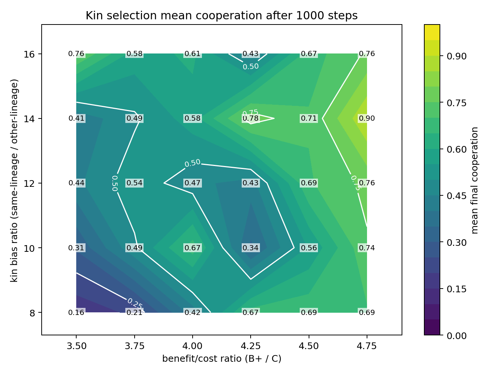
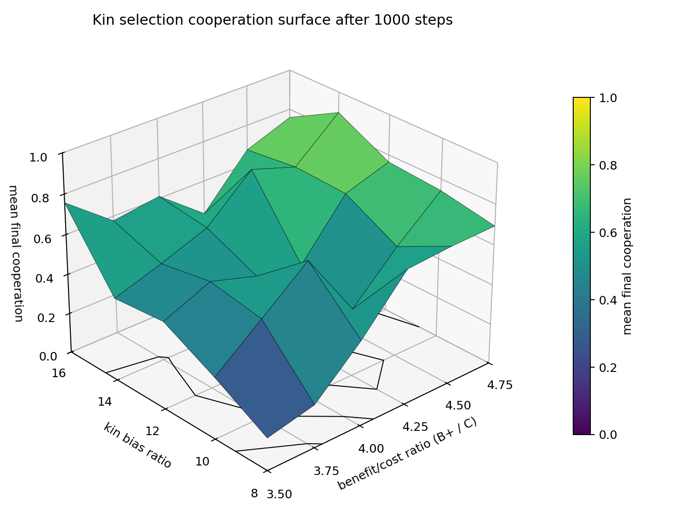

# Kin Selection Module

This package is the named kin-selection wrapper over the shared
`moran_models.interaction_kernel.core` Moran engine.

Mechanism:

- producers generate a positive effect proportional to trait `h`
- positive effects are routed with lineage bias
- same-lineage recipients receive more weight than other-lineage recipients
- selection remains local Moran replacement on the spatial grid

This is the clean Nowak-style kin-selection specialization of the shared core.

## Package Contents

- `kin_selection_model.py`
  Runnable kin-selection model wrapper.
- `config/kin_selection_config.py`
  Active configuration and source of truth for kin-selection runs.

## Run

From the repo root:

```bash
./.conda/bin/python -m moran_models.nowak_mechanisms.kin_selection.kin_selection_model
```

## Live Viewer

To inspect the kin-selection run cell-by-cell:

```bash
./.conda/bin/python -m moran_models.nowak_mechanisms.kin_selection.kin_selection_pygame_ui
```

## Parameter Sweep

To map final cooperation across kin bias and benefit/cost conditions:

```bash
./.conda/bin/python -m moran_models.nowak_mechanisms.kin_selection.utils.sweep_kin_selection_phase
```

The sweep uses two derived experimental axes:


Stepwise behavior:

  `kin_bias_ratio` from `8.0` through `16.0` and `benefit_cost_ratio`
  from `3.5` through `4.75`.

## Conclusion

The parameter sweeps show a sharp threshold for the evolution of cooperation:

- Cooperation (mean final trait > 0.5) only emerges when both kin bias and benefit/cost ratio are sufficiently high.
- As kin bias increases, the minimum benefit/cost ratio required for cooperation decreases.
- For example, with kin_bias_ratio=1.0, cooperation requires benefit/cost ≥ 5.25, but with kin_bias_ratio=16.0, cooperation appears at benefit/cost as low as 3.5.
- The transition from non-cooperation to cooperation is abrupt, as confirmed by the phase map and surface plots.

These results are consistent with Hamilton’s rule: stronger kin discrimination (higher effective relatedness) allows cooperation to evolve at lower benefit/cost ratios. The model thus robustly demonstrates kin selection’s role in supporting cooperation, with the regime boundary closely matching theoretical expectations.

## Key Evidence: Phase and Surface Charts

The following charts underscore the threshold effect and regime boundary for cooperation in the kin selection model:

**Phase Map:**
  
  
  This 2D chart shows the mean final cooperation trait across the parameter grid. The sharp transition from low to high cooperation is visible as a boundary in the heatmap.

**3D Surface Plot:**
  
  
  The 3D surface plot further highlights the abrupt jump in cooperation as parameters cross the threshold, confirming the phase transition predicted by theory.

These visualizations provide direct evidence for the model’s regime boundary and the role of kin bias and benefit/cost ratio in the evolution of cooperation.
