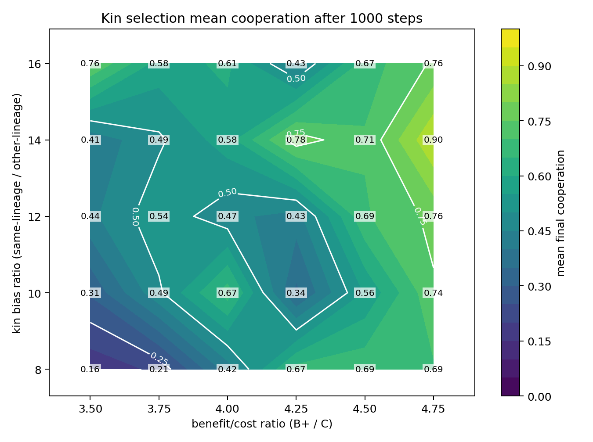
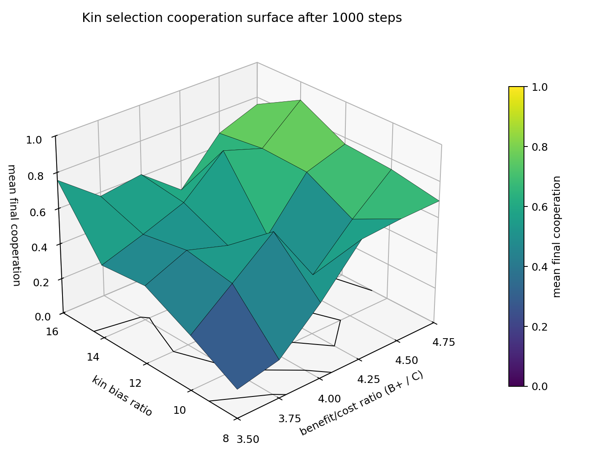

## Key Evidence: Phase and Surface Charts

The following charts underscore the empirical cooperation boundary in the kin selection model. In these sweeps, cooperation is counted as emerging when the mean final trait is greater than `0.5`.

- **Phase Map:**
  
  
  This 2D chart shows the mean final cooperation trait across the parameter grid. The sharp transition from low to high cooperation is visible as a boundary in the heatmap.

- **3D Surface Plot:**
  
  
  The 3D surface plot further highlights the abrupt jump in cooperation as parameters cross the empirical `mean_final_trait > 0.5` boundary.

This empirical boundary is related to, but not identical with, the theoretical Hamilton condition `rB > C`: the chart boundary is measured from finite stochastic simulations with local replacement, mutation, spatial neighborhoods, and row-normalized routing.

These visualizations provide direct evidence for the model’s observed regime boundary and the role of kin bias and benefit/cost ratio in the evolution of cooperation.
