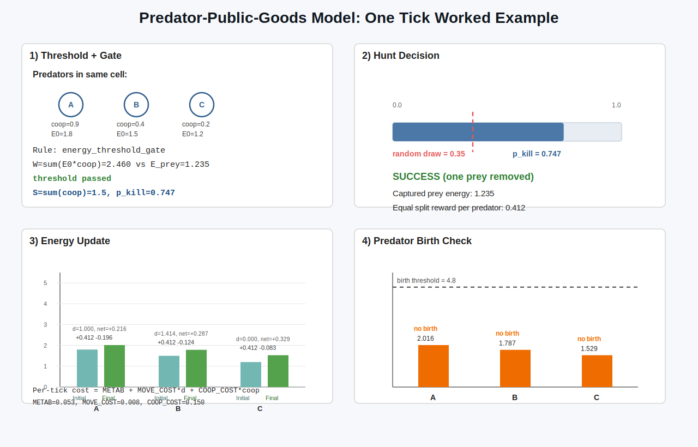
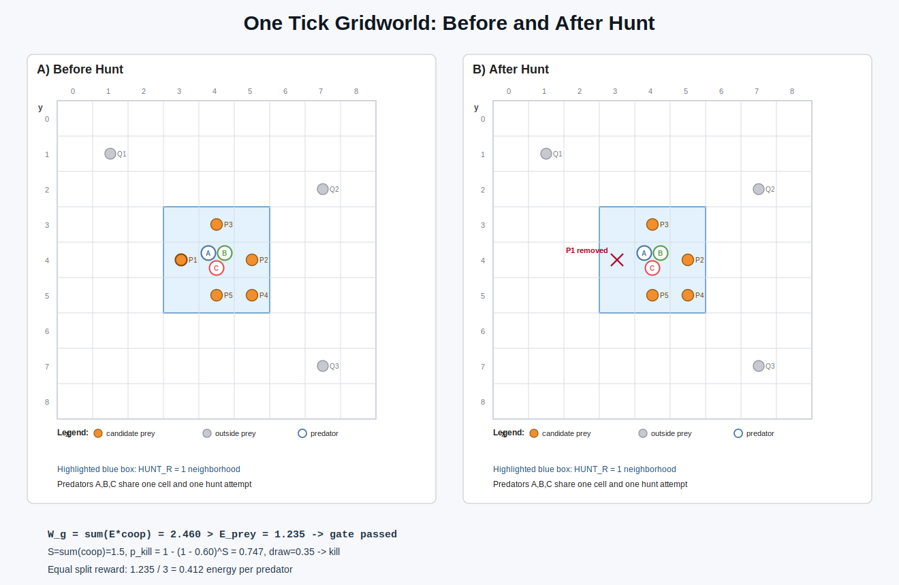

# Predator--Prey Cooperation Model Results

## With Formal Evolutionary Interpretation

This document summarizes the current predator--prey cooperation results
and provides a theoretical interpretation using:

- Hamilton's Rule (kin assortment framing)
- Multilevel Selection
- Price Equation
- Public Goods Game Structure
- Spatial Assortment

## Contents

1. Ecological Dynamics
2. Evolutionary Dynamics
3. Hamilton's Rule Interpretation
4. Multilevel Selection Perspective
5. Price Equation Formulation
6. Spatial Assortment
7. Public Goods Game Structure (Current Implementation)
8. Trait Reference View (Selected Chart)
9. Adaptive Parameter Sweep (`COOP_COST` x `P0`)
10. Interpretation of the Full System
11. Visualization Notes
12. Reproduction of Results
13. Key Parameter Settings
14. Next Directions
## Group-Hunt Cooperation Metric

The module has been simplified to focus on cooperation rather than free-rider
classification.

The main event-conditioned hunt metrics are now:

- `cooperative_hunter_share_hist`
- `group_hunt_mean_effort_hist`

This metric asks:

- among hunters that participated in successful multi-hunter kills at time `t`,
  what share expressed clearly cooperative effort?

The second metric asks:

- among that same set of hunters at time `t`, what was their mean expressed
  cooperation level?

The denominator is:

- total hunters that participated in successful multi-hunter kills at step `t`

If `H_t` is the set of hunters in successful multi-hunter kills at time `t`,
then the chart shows:

- `cooperative_hunter_count / |H_t|`
- `(sum_{i in H_t} expressed_coop_i) / |H_t|`

where a hunter is counted as cooperative if:

- it participated in a successful multi-hunter kill,
- it received positive reward from that successful hunt,
- its expressed cooperation satisfied
  `expressed_coop_i >= COOPERATIVE_HUNTER_EFFORT_MIN`

With current defaults:

- cooperative effort threshold = `0.65`

## What The Live Chart Means

The lower live pygame chart is now labeled `Raw cooperation rate`.
It shows one population-wide series only:

- `Population coop raw`: the raw current-step mean cooperation trait across all
  living predators

Formally, if `N_t` is the number of living predators at step `t` and `c_i` is
predator `i`'s stored cooperation trait `p.coop`, then:

`mean_coop_t = (1 / N_t) * sum_{i=1}^{N_t} c_i`

Implementation details:

- this is the mean of stored predator trait values `p.coop`
- it is not the hunt-time `expressed_coop` value used when plasticity is active
- if `N_t = 0`, the code records `mean_coop_t = 0.0`

In the live pygame side panel, the raw population value is surfaced explicitly
as:

- `Population mean coop (raw): X.XXX`

Axis styling in the live pygame charts:

- the upper population-history chart no longer shows a y-axis label
- the lower raw-cooperation chart no longer shows a y-axis label
- the upper chart y-axis ticks are rendered as whole-number population counts
- the lower chart y-axis is fixed to `0.00`, `0.50`, and `1.00`
- chart tick numbers on both charts and both axes are now drawn larger for readability
- chart tick numbers now use a monospace font so digits render with consistent width

## Raw Series Vs Live Chart

The default live display in the codebase is now the pygame viewer only:

- the live pygame lower chart shows only the raw population mean cooperation
  line
- the live pygame side panel also stays population-level only

The live chart therefore exposes the unsmoothed population-wide cooperation
signal directly.

## How This Differs From Mean Cooperation

`mean_coop_hist` is the per-step history of the population mean predator
cooperation trait over all living predators.

It asks:

- what is the average cooperation trait among all living predators?

`cooperative_hunter_share_hist` asks instead:

- among hunters in successful multi-hunter kills, what share were strongly
  cooperative at that moment?

`group_hunt_mean_effort_hist` asks:

- among those same hunters, how cooperative was the average expressed effort?

So:

- `mean_coop_hist` is a whole-population trait summary
- `cooperative_hunter_share_hist` is a successful-group-hunt cooperation summary
- `group_hunt_mean_effort_hist` is a successful-group-hunt average effort summary

Stepwise update of the chart interpretation:

1. The chart originally showed only successful-group-hunt cooperation metrics.
2. A population-wide mean cooperation line was then added so the live view also
  exposed whole-population trait dynamics.
3. The chart title was renamed from `Group-hunt cooperation` to
  `Cooperation metrics` because it now mixes population-wide and
  event-conditioned signals.
4. The live view now also includes the raw current-step population mean so the
  user can compare raw and smoothed population cooperation directly.
5. The lower live pygame chart has now been simplified again to show only the
   raw population cooperation rate.
6. The live pygame side panel no longer shows successful-hunt numeric fields,
   so the live viewer is population-level for cooperation throughout.
7. The live chart y-axis labels have been removed, and the upper chart now uses
   integer-only y-axis tick labels.
8. The chart tick-number font has been increased so both charts show larger
   axis numbers.
9. The chart tick numbers now use a fixed-width font so labels such as `111`
   and `888` render with consistent digit sizing.
10. The lower live chart now uses a fixed `0.00-1.00` cooperation axis, so the
    y-axis scale no longer shifts with small range changes in the data.
11. The standalone matplotlib `Cooperation metrics` figure is no longer shown
    by `main()`.
12. The standalone matplotlib local clustering heatmap is no longer shown by
    `main()`.

## Practical Reading Guide

- The live pygame viewer now answers one population-level question directly:
  how the mean predator cooperation trait changes over time.
- Successful-group-hunt cooperation summaries are still recorded in the run
  histories and downstream sweep/tuning outputs, but they are no longer shown
  as a standalone matplotlib figure in the default run.

## Cooperation Cost vs Hunt Income Diagnostic

The matplotlib macro-energy figure now includes a dedicated cooperation
tradeoff panel.

It answers a direct question:

- does cooperation pay for itself through hunt intake, or is it draining
  predator energy overall?

Stepwise update of this diagnostic:

1. The simulation now records `pred_coop_loss` per tick as its own history
   channel instead of leaving it visible only inside the combined predator
   decay total.
2. It also records `coop_net_hunt_return = prey_to_pred - pred_coop_loss` per
   tick, so positive values mean hunt income exceeded cooperation cost on that
   step.
3. The macro-energy plot now has a middle panel showing:
   - `hunt income`
   - `cooperation cost`
   - `net after coop`
4. The run summary printed to the terminal now includes a cumulative
   cooperation tradeoff line:
   - total hunt income
   - total cooperation cost
   - net after cooperation cost
   - cost share of hunt income

Interpretation:

- If `net after coop` stays mostly above zero, cooperation is costly but still
  energetically worthwhile at the system level.
- If it stays near zero or below zero, the current cooperation level is likely
  too expensive relative to the prey-energy captured.

------------------------------------------------------------------------

# 3. Hamilton's Rule Interpretation

Let cooperation level be trait `c`.

Hamilton's inequality in reduced form is:

`r b > c`

where:

- `r` is local assortment/relatedness-like structure,
- `b` is the marginal group benefit from additional contribution,
- `c` is the individual cost of contribution.

In this model:

- Local birth and movement structure can keep positive assortment.
- Benefit saturation is controlled by the hunt function via `P0`.
- Per-tick cooperation cost (`COOP_COST * coop_expr`) provides direct individual
  cost (`coop_expr=coop` when plasticity is off).

Because `b` is state-dependent (group composition and `P0`), the net selection
gradient is not globally positive. That matches the observed intermediate regime.

------------------------------------------------------------------------

# 4. Multilevel Selection Perspective

A standard decomposition is:

$$
\Delta \bar{z}=\frac{\mathrm{Cov}_g(W_g,z_g)}{\bar{W}}+\frac{\mathbb{E}_g\left[\mathrm{Cov}_i(W_i,z_i)\right]}{\bar{W}}
$$

Interpretation for this system:

- Between-group component: more cooperative local groups can convert prey
  encounters into energy more reliably.
- Within-group component: each individual pays its own cooperation cost while
  reward is shared at group level.

This naturally allows mixed outcomes where cooperation is maintained but does
not necessarily fix at 1.0.

------------------------------------------------------------------------

# 5. Price Equation Formulation

At population level:

$$
\Delta \bar{z}=\frac{\mathrm{Cov}(W,z)}{\bar{W}}+\frac{\mathbb{E}\left[W\,\Delta z_{\mathrm{transmission}}\right]}{\bar{W}}
$$

With mutation, spatial turnover, and ecological fluctuations, the covariance term
can be positive in some states and weak/negative in others.

Empirically, the current trajectory is consistent with:

- sustained nonzero covariance favoring cooperation early,
- followed by an interior regime where costs and saturated benefits balance.

------------------------------------------------------------------------

# 6. Spatial Assortment

## Local Clustering Heatmap

<p align="center">
  
</p>

Observed in the current chart:

- Predators occupy clustered patches rather than a uniform field.
- Many dark regions are predator-empty neighborhoods.
- Occupied patches show intermediate-to-high local cooperation values.

## Live Grid Snapshot

<p align="center">
  
</p>

Observed in the current snapshot:

- Predator trait colors are mostly mid-range.
- Prey density and predator occupancy are spatially heterogeneous.
- Spatial structure and trait structure are visibly coupled.

------------------------------------------------------------------------

# 7. Public Goods Game Structure (Current Implementation)

The implemented hunt rule is trait-based public sharing among local hunters:

- Hunters are assembled locally around each prey candidate.
- A hard gate requires coop-weighted hunter power to exceed prey energy.
- In `energy_threshold_gate` mode, success is additionally probabilistic:
  `p_kill = 1 - (1 - P0)^sum(coop)`.
- On success, captured prey energy is transferred to hunters (no fixed
  synthetic kill reward).
- Reward split mode is configurable:
  - `EQUAL_SPLIT_REWARDS=True`: equal split.
  - `EQUAL_SPLIT_REWARDS=False`: contribution-weighted split.
- Each predator still pays its own cooperation cost every tick.

This creates a social-dilemma-like tension:

- Group performance improves with higher total contribution.
- Individual marginal incentive can weaken as group contribution grows.

That mechanism is compatible with stable intermediate cooperation.

## Why Cooperation Does Not Simply Fix At 1.0

The current code creates a direct cost-benefit tradeoff for cooperation:

- Cost: each predator pays `COOP_COST * coop_expr` every tick.
- Benefit: higher `coop_expr` raises local hunt success and coop-weighted team
  power.
- Tension: when `EQUAL_SPLIT_REWARDS=True`, successful hunts are split equally,
  so a high-contributing predator can pay more cost without receiving more
  reward than a low contributor.

This means selection is not uniformly pro-cooperation. Cooperation is favored
when the added hunt benefit outweighs the private per-tick cost, but disfavored
when costs dominate or when equal sharing lets lower contributors capture the
same reward. That is why the model naturally supports interior, non-fixing
cooperation levels rather than a guaranteed march to full cooperation.

Important nuance:

- A predator with `coop_expr = 0` pays zero cooperation surcharge.
- If `EQUAL_SPLIT_REWARDS=True`, that same predator can still receive an equal
  share of prey reward after a successful hunt.
- This is not the same as paying zero total cost of living: metabolism and move
  costs still apply.
- Zero cooperation now means zero direct hunt contribution under the current
  contribution rule `energy_i * coop_expr_i`.

## Textbook PGG Mapping (Code Anchors)

The model is not a one-shot matrix game, but its hunt module maps cleanly to
public-goods components:

| Public-goods element | Current model implementation |
|---|---|
| Players in a group | Predators in the local hunter pool around a focal prey (`HUNTER_POOL_R`) |
| Individual contribution | `w_i = energy_i * coop_i^expr` |
| Public good production | Team power is aggregated and compared to prey energy (hard gate); optional extra probabilistic gate via `P0` |
| Private contribution cost | Per-tick individual cost `COOP_COST * coop_expr_i` (plus general metabolic/move costs, with `coop_expr_i=coop_i` if plasticity is off) |
| Group benefit size | Captured prey energy `E_prey` on successful hunt |
| Benefit sharing rule | Equal split when `EQUAL_SPLIT_REWARDS=True`; contribution-weighted when `EQUAL_SPLIT_REWARDS=False` |
| Cooperation readout | The module now tracks a cooperation-first successful-hunt summary rather than a dedicated free-rider metric |
| Evolutionary update | No learning policy; trait `coop` is inherited with mutation at reproduction |

Interpretation:

- This is a spatial, repeated, ecological public-goods game with endogenous
  group formation and resource-coupled payoffs.
- It is public-goods-like in mechanism, but richer than canonical static PGG
  because survival, prey dynamics, grass, and reproduction feed back into payoffs.

## Theory-to-Code Map (Intro Literature)

| Reference | Main idea | Where it appears in this model |
|---|---|---|
| Hamilton (1964) | Inclusive-fitness style tradeoff (`r b > c`) | `c`: per-step private cost `COOP_COST * coop_expr` (`coop_expr=coop` if plasticity is off); `b`: higher local hunt success/payoff via coop-weighted team power; `r`-like structure: local neighborhoods (`HUNT_R`, `HUNTER_POOL_R`) |
| Nowak (2006) | Rules for cooperation (especially spatial reciprocity) | Local interaction structure drives cooperative clustering and hunt outcomes; cooperation remains trait-based (`coop`) rather than action/learning based |
| Okasha (2006), Frank (1998) | Multilevel / Price-style decomposition | Between-group proxy: local group hunt conversion; within-group proxy: private cooperation costs and split-gap diagnostics (`low_contrib_overpay`, `high_contrib_underpay`) |
| Hendry (2017) | Eco-evolutionary feedbacks | Ecology: grass->prey->predator energy flows plus decay; evolution: inherited `coop`, mutation (`MUT_RATE`, `MUT_SIGMA`), selection via survival/reproduction |
| Perc et al. (2017) | Statistical-physics framing of cooperation, especially public-goods and spatial pattern dynamics | Public-goods hunt mechanics, spatial neighborhoods, stochastic update order, and phase-like regime changes across parameter sweeps |

This map is intentionally conceptual: the code is an ecological ABM, not an
analytical closed-form model, but each theoretical construct has a direct
mechanistic counterpart in the implementation.

------------------------------------------------------------------------

# 8. Trait Reference View (Selected Chart)

<p align="center">
  
</p>

This selected reference chart shows:

- an early transient increase,
- then long-run intermediate cooperation,
- with no terminal drop-to-zero event in this figure.

------------------------------------------------------------------------

# 9. Adaptive Parameter Sweep (`COOP_COST` x `P0`)

Sweep outputs currently used here are in `predprey_public_goods/images/`.
Metric per cell: mean cooperation over tail window, averaged across successful runs.

## Round 1 (broad scan)

<p align="center">
  
</p>

Observed pattern:

- Co-existence of predators and prey emerges at various mean cooperation
- Highest mean cooperation appears at low `COOP_COST`, low `P0`.
- Cooperation generally decreases as either `COOP_COST` or `P0` increases.
- Gray regions indicate cells without enough successful runs.

## Round 2 (high-cost/high-`P0` refinement)

<p align="center">
  
</p>

Observed pattern:

- Cooperation is mostly low-to-moderate in this region.
- Local stochastic pockets exist, but no broad high-cooperation band appears.

## Round 3 (moderate-`P0`, lower-cost refinement)

<p align="center">
  
</p>

Observed pattern:

- Cooperation is generally higher than in Round 2.
- A broad intermediate band (roughly 0.35-0.55) is visible, with local peaks.

Important limit of interpretation:

- These heatmaps do not identify a single minimum cooperation threshold needed
  for coexistence.
- They summarize cooperation levels in successful finite-horizon runs; they are
  not direct equilibrium-threshold maps.

------------------------------------------------------------------------

# 10. Interpretation of the Full System

Current combined evidence supports:

- persistent predator--prey oscillations,
- non-fixating intermediate cooperation in the baseline trait trajectory,
- spatial clustering that shapes both ecology and selection,
- parameter-dependent cooperation regimes in sweep analysis.

The system is best interpreted as state-dependent selection under ecological
feedbacks, rather than a globally monotonic drive to full cooperation.

## Mutual-Survival Retune

The default ecological parameters were retuned to make mutual predator--prey
survival more likely.

The practical goal of the retune was not to eliminate all extinctions. It was
to move the default regime away from the earlier pattern where prey collapse was
the dominant outcome across seeds.

The current defaults are now set to the best candidate found by the automated
96-candidate coarse search. The original coexistence-oriented ranking and the
later completed `prey_collapse_penalty` ranking both selected the same default
parameter set. That winning candidate was:

- `PRED_INIT=65`
- `PREY_INIT=575`
- `PRED_ENERGY_INIT=1.4`
- `METAB_PRED=0.055`
- `BIRTH_THRESH_PRED=4.8`
- `PRED_REPRO_PROB=0.045`
- `P0=0.56`
- `PREY_MOVE_PROB=0.30`
- `PREY_REPRO_PROB=0.07`
- `PREY_BIRTH_SPLIT=0.42`

In the completed penalty-mode run, this setting reached `5/8` coexistence runs,
with the remaining `3/8` failures still being prey-collapse failures rather
than predator-collapse failures.

The retune works through three coordinated changes:

- lower initial predator pressure:
  fewer predators start the run and each starts with less energy
- slower predator amplification:
  moderated `P0`, slightly higher predator reproduction probability than the
  previous retuned default, higher predator
  reproduction threshold, and slightly higher predator metabolism
- faster prey recovery:
  moderate prey reproduction probability, larger prey birth-energy split, and
  higher prey movement to reduce local overexploitation

Stepwise update of the retune:

1. The first manual retune moved the model away from near-immediate prey
  collapse by reducing predator pressure and strengthening prey recovery.
2. The automatic tuner then evaluated a coarse 96-candidate grid around that
  retuned region using 8 seeds per candidate.
3. The rank-1 candidate from that search was promoted to the code
  defaults in `emerging_cooperation.py`.
4. This promotion changes three defaults relative to the previous retune:
  `PRED_REPRO_PROB` from `0.04` to `0.045`, `P0` from `0.54` to `0.56`, and
  `PREY_REPRO_PROB` from `0.072` to `0.07`.
5. The later `prey_collapse_penalty` completion run finished `96/96` candidates
  and confirmed the same winner, so the current defaults remain the final
  recommended setting from the tested grid.
6. The completed penalty-mode artifacts are:
  `predpreygrass_public_goods/images/mutual_survival_tuning_prey_collapse_penalty_20260325_001313.csv`
  and
  `predpreygrass_public_goods/images/mutual_survival_tuning_prey_collapse_penalty_20260325_001313_top.txt`.

------------------------------------------------------------------------

# 11. Visualization Notes

Core ecology/trait figures are generated from:

- `predpreygrass_public_goods/emerging_cooperation.py`

Sweep figures are generated from:

- `predpreygrass_public_goods/sweep_dual_parameter.py`
- `predpreygrass_public_goods/tune_mutual_survival.py` for automatic
  coexistence-oriented parameter search

Animation views:

- Disentangled 3-panel live view (`ANIMATE=True`):
  panel 1 local cooperation heatmap,
  panel 2 prey density heatmap (log-scaled, zeros masked),
  panel 3 predator trait map (positions colored by cooperation),
  each with its own legend/colorbar.
- Optional simple live grid (`ANIMATE_SIMPLE_GRID=True`):
  grass heatmap background with prey and predator markers.
- Optional macro-flow figure (`PLOT_MACRO_ENERGY_FLOWS=True`):
  per-tick channels
  `photosynthesis->grass`, `grass->prey`, `prey->predator`,
  `prey->decay`, `predator->decay`,
  plus cumulative energy stocks per tick
  (`grass`, `prey`, `predator`, and total sum).

Stepwise update for the live pygame footprint:

1. `LIVE_RENDER_CELL_SIZE` is now treated as the preferred upper-bound cell
   size rather than a fixed on-screen tile size.
2. `run_sim()` now constructs `PyGameRenderer(..., auto_fit=True)`, so the
   viewer clamps cell size against the current display dimensions before the
   window is opened.
3. The logical ecology grid remains `60 x 60`, so the screen-fit change does
   not alter movement rules, encounter geometry, or population density.
4. The live pygame side panel now switches to a compact responsive layout so
   the two live charts remain visible after the board is scaled down.
5. The panel legends are arranged side-by-side when width allows, which
   recovers vertical space for the chart block.
6. The chart renderer now uses smaller dynamic text/padding so short panel
   heights still produce readable plot areas instead of hiding the charts.

------------------------------------------------------------------------

# 12. Reproduction of Results

From repo root:

```bash
./.conda/bin/python predpreygrass_public_goods/emerging_cooperation.py
./.conda/bin/python predpreygrass_public_goods/sweep_dual_parameter.py
./.conda/bin/python predpreygrass_public_goods/tune_mutual_survival.py
./.conda/bin/python predpreygrass_public_goods/resume_mutual_survival_until_done.py
```

Notes:

- Sweep images are saved under `predpreygrass_public_goods/images/`.
- The sweep now writes one heatmap per configured metric in
  `HEATMAP_METRICS`. By default this includes:
  `mean_coop`, `mean_group_hunt_share`, and `mean_group_hunt_effort`.
- Sweep heatmap filenames now also include the active
  `ADAPTIVE_RANK_METRIC`, so adaptive runs are self-identifying on disk.
- If adaptive refinement is enabled, the cells used to choose the next search
  window are ranked by `ADAPTIVE_RANK_METRIC` rather than being hard-wired to
  `mean_coop`.
- Adaptive runs also write a per-round refinement report listing the selected
  top cells and the resulting refined bounds.
- Adaptive runs also write a per-round `*_refinement_cells.csv` file with the
  selected top cells and their metric values.
- Baseline plots are shown interactively unless you add explicit save logic.
- For deterministic baselines, set `SEED` in
  `predpreygrass_public_goods/emerging_cooperation.py`.
- The mutual-survival tuner uses an in-file parameter grid and now evaluates
  candidates in batches, writing checkpoint files after each batch so long runs
  can resume instead of restarting.
- The tuner can also re-enter from its own checkpoint in repeated passes inside
  one invocation when `RUN_UNTIL_COMPLETE=True`.
- Checkpoint outputs are written as
  `predpreygrass_public_goods/images/mutual_survival_tuning_<ranking_mode>_checkpoint.csv`
  and
  `predpreygrass_public_goods/images/mutual_survival_tuning_<ranking_mode>_checkpoint_top.txt`.
- At the end of a completed run it also writes a timestamped ranked CSV plus a
  short top-results summary into `predpreygrass_public_goods/images/`.
- The completed penalty-mode confirmation run produced:
  `predpreygrass_public_goods/images/mutual_survival_tuning_prey_collapse_penalty_20260325_001313.csv`
  and
  `predpreygrass_public_goods/images/mutual_survival_tuning_prey_collapse_penalty_20260325_001313_top.txt`.
- The tuner top-summary now reports successful-run hunt cooperation as two
  named fields:
  `mean_group_hunt_share_success` and
  `mean_group_hunt_effort_success`.
- The tuner ranking behavior is now controlled by `RANKING_MODE`:
  `coexistence` keeps the original coexistence-first ordering, while
  `prey_collapse_penalty` adds a stronger penalty for prey-collapse-heavy
  candidates.
- If you want a dedicated resume-only entrypoint, use
  `predpreygrass_public_goods/resume_mutual_survival_until_done.py`, which
  forces `resume=True` and can clamp worker count to a safer value for long
  runs.

------------------------------------------------------------------------

# 13. Key Parameter Settings

Defaults in `predpreygrass_public_goods/emerging_cooperation.py`:

- Grid: `W=60`, `H=60`
- Initial populations: `PRED_INIT=65`, `PREY_INIT=575`
- Predator initial energy: `PRED_ENERGY_INIT=1.4`
- Steps: `STEPS=1000`
- Predator costs: `METAB_PRED=0.055`, `MOVE_COST=0.008`, `COOP_COST=0.08`
- Predator reproduction: `BIRTH_THRESH_PRED=4.8`, `PRED_REPRO_PROB=0.045`,
  `PRED_MAX=800`, `LOCAL_BIRTH_R=1`
- Mutation: `MUT_RATE=0.03`, `MUT_SIGMA=0.08`
- Hunt: `HUNT_RULE="energy_threshold_gate"`, `HUNT_R=1`,
  `HUNTER_POOL_R=1`, `P0=0.56`,
  `EQUAL_SPLIT_REWARDS=True`
- Optional plasticity (default off, pure nature preserved):
  `ENABLE_PLASTICITY=False`, `PLASTICITY_STRENGTH=0.25`,
  `PLASTICITY_RATIO_SETPOINT=4.0`, `PLASTICITY_RATIO_SCALE=2.0`
- Logging: `LOG_REWARD_SPLIT=False`, `LOG_ENERGY_BUDGET=False`,
  `ENERGY_LOG_EVERY=1`, `ENERGY_INVARIANT_TOL=1e-6`
- Prey: `PREY_MOVE_PROB=0.30`, `PREY_REPRO_PROB=0.07`, `PREY_MAX=3200`,
  `PREY_ENERGY_MEAN=1.1`, `PREY_ENERGY_SIGMA=0.25`, `PREY_ENERGY_MIN=0.10`,
  `PREY_METAB=0.05`, `PREY_MOVE_COST=0.01`, `PREY_BIRTH_THRESH=2.0`,
  `PREY_BIRTH_SPLIT=0.42`, `PREY_BITE_SIZE=0.24`
- Grass: `GRASS_INIT=0.8`, `GRASS_MAX=3.0`, `GRASS_REGROWTH=0.055`
- Clustering radius: `CLUST_R=2`
- Live pygame viewer: `LIVE_RENDER_PYGAME=True`, `LIVE_RENDER_FPS=30`,
  `LIVE_RENDER_CELL_SIZE=14` with display auto-fit enabled in `run_sim()`

Stepwise update for the baseline run horizon:

1. The default baseline simulation length in
   `predpreygrass_public_goods/emerging_cooperation.py` has been reduced from
   `2500` steps to `1000` steps.
2. This shortens the default live run and the default history length used by
   the built-in plots without changing the per-step ecology.
3. `SEED=0` remains the deterministic default seed, but the old README/source
   wording that tied it specifically to a `2500`-step survival statement has
   been removed.

Defaults in `predpreygrass_public_goods/sweep_dual_parameter.py`:

- `COOP_COST` range: `0.00-1.00` (step `0.01`)
- `P0` range: `0.00-1.00` (step `0.01`)
- `successes=10`, `max_attempts=100`, `tail_window=200`, `steps=1500`
- `heatmap_metrics=['mean_coop', 'mean_group_hunt_share', 'mean_group_hunt_effort']`
- `adaptive_rank_metric='mean_coop'`
- Adaptive defaults: `adaptive=False`, `rounds=3`, `top_k=5`,
  `refine_step_factor=0.5`
- Adaptive report output: one `*_refinement.txt` file per round
- Adaptive selected-cell CSV output: one `*_refinement_cells.csv` file per round

Defaults in `predpreygrass_public_goods/tune_mutual_survival.py`:

- `ranking_mode='prey_collapse_penalty'`
- alternative: `ranking_mode='coexistence'`
- `run_until_complete=True`
- `max_resume_passes=12`

Defaults in `predpreygrass_public_goods/resume_mutual_survival_until_done.py`:

- `FORCE_WORKERS=1`
- `MAX_PASSES_OVERRIDE=24`

------------------------------------------------------------------------

# 14. Next Directions

- Add an explicit coexistence probability map (`Pr[survival to T]`) alongside
  mean cooperation maps.
- Track and report extinction boundary curves in (`COOP_COST`, `P0`) space.
- Estimate effective assortment `r(t)` directly from local trait correlation.
- Compare single-seed trajectories against multi-seed confidence intervals.
- Add optional deterministic export pipeline for baseline figures.
- Expand the mutual-survival tuner into a two-stage coarse-to-fine search once a
  preferred coexistence score is fixed.

------------------------------------------------------------------------

# 15. Mathematical Derivation (Current Reward Rule)

This section summarizes the implemented hard-gate reward logic.

For a candidate prey `v` and local hunter set `g`:

- Expressed cooperation trait:
  `c_j^expr(t) = clamp01(c_j + Delta_plast(t))`
- Trait sum: `S_g = sum_{j in g} c_j^expr(t)`
- Cooperative power / contribution total:
  `P_g = sum_{j in g} e_j * c_j^expr(t)`
- Captured prey energy: `E_v`

Plasticity shift (optional, deterministic, trait-based):

- If `ENABLE_PLASTICITY=False`: `Delta_plast(t)=0`
- If `ENABLE_PLASTICITY=True`:
  `Delta_plast(t)=PLASTICITY_STRENGTH * tanh((prey/pred - setpoint)/scale)`

Gate 1 (hard constraint):

`P_g >= E_v`

Gate 2 (probabilistic success in `energy_threshold_gate` mode):

`p_kill(S_g) = 1 - (1 - p0)^(S_g)`

If both gates pass, captured prey energy is distributed:

- Equal split mode (`EQUAL_SPLIT_REWARDS=True`):
  `G_i = E_v / n_g`
- Contribution-weighted mode (`EQUAL_SPLIT_REWARDS=False`):
  `G_i = E_v * w_i / sum_{j in g} w_j`,
  with `w_i = e_i * c_i^expr`

Per-tick predator cost:

`C_i = METAB_PRED + MOVE_COST + COOP_COST * c_i^expr(t)`

A local fitness proxy under gate mode is therefore:

`W_i ~ I(P_g >= E_v) * p_kill(S_g) * G_i - C_i`

Because benefits are both thresholded and saturating while costs are linear in
`c_i`, interior cooperation regimes remain expected.

## Compact Equations (Code Variable Names)

For predator `i` in local hunter set `g`:

`coop_expr_i = clamp01(coop_i + Delta_plast(t))`

`w_i = energy_i * coop_expr_i`

`W_g = sum_{i in g} w_i`

`S_g = sum_{i in g} coop_expr_i`

For prey with energy `E_prey`:

`p_kill = 0, if W_g < E_prey`

`p_kill = 1, if HUNT_RULE == "energy_threshold" and W_g >= E_prey`

`p_kill = 1 - (1 - P0)^(S_g), if HUNT_RULE == "energy_threshold_gate" and W_g >= E_prey`

On successful capture:

`E_pool = E_prey`

`gain_i = E_pool / n_hunters`, if `EQUAL_SPLIT_REWARDS=True`

`gain_i = E_pool * w_i / sum_{j in g} w_j`, if `EQUAL_SPLIT_REWARDS=False`

Per-step predator private cost:

`cost_i = METAB_PRED + MOVE_COST + COOP_COST * coop_expr_i` (applied via clamped drains)

Core macro flow channels per tick:

`photosynthesis_to_grass = grass_regen`

`grass_to_prey = sum(bite_i)`, with `bite_i = min(PREY_BITE_SIZE, grass_cell_i)`

`prey_to_predator = sum(E_prey over successful kills)`

`prey_to_decay = prey_metab_loss + prey_move_loss`

`predator_to_decay = pred_metab_loss + pred_move_loss + pred_coop_loss`

Energy-balance identity checked each tick:

`delta_total = grass_regen - (prey_to_decay + predator_to_decay) + residual`

with `residual` expected near zero (tracked against `ENERGY_INVARIANT_TOL`).

Cumulative stock view (net balance in plots):

`E_grass(t) = sum(grass[y, x])`

`E_prey(t) = sum(prey.energy)`

`E_predator(t) = sum(predator.energy)`

`E_total(t) = E_grass(t) + E_prey(t) + E_predator(t)`

------------------------------------------------------------------------

# 16. Simulation Logic (Code-Level)

This section documents the exact update order used in
`predpreygrass_public_goods/emerging_cooperation.py`.

## State Variables

- Predator agent: `(x, y, energy, coop)` where `coop in [0,1]`.
- Prey agent: `(x, y, energy)`.
- Grass field: per-cell energy `grass[y, x]`.
- Space is a wrapped torus (`wrap`), so movement beyond an edge re-enters on
  the opposite side.

## Per-Tick Update Order

1. Grass regrowth (`GRASS_REGROWTH`, capped by `GRASS_MAX`).
2. Prey phase: movement, clamped energy costs, single grass bite, reproduction.
3. Build spatial indexes for prey and predators.
4. Optional deterministic trait expression shift (if `ENABLE_PLASTICITY=True`):
   compute `coop_expr = clamp01(coop + Delta_plast)` from prey/pred ratio.
5. Prey-centric engagement resolution (capture only; uses `coop_expr`).
6. Explicit prey cleanup (starved + hunted), then append prey newborns.
7. Predator phase: clamped costs, movement, reproduction, mutation, cleanup
   (cooperation cost uses `coop_expr` when plasticity is enabled).
8. Optional run-level diagnostics: reward split and energy-budget invariant.

## Prey Dynamics

- Each prey moves with probability `PREY_MOVE_PROB` by a local step in
  `{ -1, 0, 1 }` for x and y.
- Each prey pays `PREY_METAB` and (if moved) `PREY_MOVE_COST` via clamped
  drains (`drain_energy`), so paid cost cannot exceed current energy.
- Each prey consumes grass at its cell up to `PREY_BITE_SIZE`.
- Prey with `energy <= 0` are removed.
- Reproduction is density-limited by:
  `repro_scale = max(0, 1 - prey_count / PREY_MAX)`.
- Birth is energy-gated (`energy >= PREY_BIRTH_THRESH`) and stochastic:
  `PREY_REPRO_PROB * repro_scale`.
- On birth, child gets `PREY_BIRTH_SPLIT * parent_energy` and the parent loses
  that energy.
- Newborn prey are buffered and appended only after engagements, so they act
  from the next tick.

## Hunting Logic

- Engagements iterate over live prey (prey-centric order).
- Candidate hunters are collected from cells in square neighborhood radius
  `HUNT_R` (Chebyshev radius) around each prey.
- Hunters are pooled around each victim using `HUNTER_POOL_R`.
- Hard gate: cooperative weighted power must exceed prey energy.
- In `energy_threshold_gate` mode, an additional probabilistic gate is applied:
  `p_kill = 1 - (1 - P0)^S` with `S = sum(coop_expr_i)`.
- If a kill occurs, prey energy is transferred to hunters.
- Split is equal when `EQUAL_SPLIT_REWARDS=True`, otherwise
  contribution-weighted.

## Predator Energy, Reproduction, Mutation

- Each predator pays per tick:
  `METAB_PRED + MOVE_COST + COOP_COST * coop_expr` via clamped drains
  (`coop_expr=coop` when plasticity is disabled).
- Predators then move by a local wrapped step.
- Reproduction is thresholded and probabilistic:
  `energy >= BIRTH_THRESH_PRED` and
  `random < PRED_REPRO_PROB * pred_repro_scale`.
- `pred_repro_scale` includes predator crowding (`PRED_MAX`) and prey
  availability (`len(preys) / PREY_INIT`).
- On reproduction, parent energy is halved; child inherits parent trait and
  local position.
- Child mutates with probability `MUT_RATE`:
  `coop_child = clamp01(coop_parent + Normal(0, MUT_SIGMA))`.
- Predators with `energy <= 0` are removed.

## Run Termination and Outputs

- A run stops early if either predators or prey go extinct (`pred_n == 0` or
  `prey_n == 0`); this is an extinction run.
- A run is marked successful only if no extinction occurs before `STEPS`.
- With `RESTART_ON_EXTINCTION=True`, `main()` retries up to `MAX_RESTARTS`.
- If enabled, the run logs:
  - reward split metrics (kills, captured energy, split inequality),
  - per-step energy budget fields:
    `d_total`, `grass_in`, `grass_to_prey`, `prey_to_pred`, `dissipative_loss`,
    expected delta, and residual with `[OK]/[WARN]` against
    `ENERGY_INVARIANT_TOL`,
  - run-level flow totals:
    `grass_regen`, `grass_to_prey`, `prey_to_pred`,
    `prey_birth_transfer`, `pred_birth_transfer`, and all dissipative
    subcomponents.
- Recorded outputs include:
  predator count history, prey count history, mean/variance cooperation history,
  cooperation-share history and mean-effort history for successful multi-hunter
  kills,
  optional animation snapshots, final predator list, `success` flag, and
  `extinction_step`.
- In the live pygame panel, the current step now shows only the raw population
  cooperation value; the successful-group-hunt summaries remain available in
  the recorded histories and downstream sweep/tuning summaries.
- The default baseline run no longer opens a standalone local clustering
  heatmap figure; local clustering remains available in the optional animation
  path and through `compute_local_clustering_field()`.

Sweep and tuner artifacts now also expose these cooperation-facing successful-
hunt summaries:

- `sweep_dual_parameter.py` CSV rows include `mean_group_hunt_share` and
  `mean_group_hunt_effort` alongside `mean_coop`.
- `tune_mutual_survival.py` ranked CSV and top-summary files include
  `mean_group_hunt_share_success` and `mean_group_hunt_effort_success` for
  successful runs.

------------------------------------------------------------------------

# 17. One-Tick Worked Example (Visual)

This diagram visualizes one concrete tick using the same numeric example used
to explain the update logic.



## Gridworld View of the Same Tick

This version shows the same numerical example in a concrete local grid:

- Predators `A,B,C` occupy one cell.
- The highlighted blue square is the `HUNT_R=1` neighborhood used to collect
  prey candidates.
- Left panel: before hunt (all candidate prey present).
- Right panel: after hunt, where one candidate prey is removed because
  `draw < p_kill`.



To regenerate:

```bash
./.conda/bin/python predprey_public_goods/visualize_tick_logic.py
```

------------------------------------------------------------------------

# 18. Comparison vs MARL Stag-Hunt (Updated)

This project intentionally keeps one core difference from
`predpreygrass/rllib/stag_hunt_forward_view`:

- Nature-focused cooperation here: cooperation is a heritable trait (`coop`).
- Nurture-focused cooperation there: cooperation is an action decision
  (`join_hunt`) each step.

What is now aligned more closely with the MARL ecology:

- Prey have explicit energy household and can starve.
- Grass is explicit, regrows each tick, and is consumed by prey.
- Predator reproduction is energy-driven with additional regulation.
- Cooperative hunt uses local pooling plus energy-threshold gating.
- Engagement order is prey-centric with explicit cleanup phases.
- Hunt reward is transferred from captured prey energy (no fixed kill reward).

What still differs (beyond the intended trait-vs-action distinction):

- No explicit `join_cost` / scavenger action channel.
- No RL action/observation API or per-agent termination/truncation outputs.
- No bounded-grid wall/LOS movement constraints.
- Single-species predator + scalar trait evolution, rather than typed MARL agent
  populations.

------------------------------------------------------------------------

# 19. Hendry (2017) Links to This Model

The model supports several core eco-evolutionary patterns discussed in Hendry's
intro framework, with direct code-level hooks:

| Hendry theme | Code-level mechanism here | Primary observables |
|---|---|---|
| Ecology-evolution feedback | Predator trait `coop` changes hunt conversion, which changes predator/prey/grass densities, which changes selection | `mean_coop_hist`, `pred_hist`, `prey_hist`, macro energy stocks |
| Selection under density dependence | Predator reproduction scales by crowding and prey availability (`pred_repro_scale`) | predator persistence, extinction timing, oscillation amplitude |
| Heritable trait + mutation | Offspring inherit `coop` with mutation (`MUT_RATE`, `MUT_SIGMA`) | trait mean/variance trajectories |
| Resource-mediated fitness | Energy transfer chain grass->prey->predator with dissipative decay | `grass_to_prey`, `prey_to_pred`, `prey_decay`, `pred_decay` |
| Spatial structure | Local hunt pools (`HUNT_R`, `HUNTER_POOL_R`) and local birth | clustering heatmap, local coexistence patterns |
| Plasticity vs genetic response | Optional deterministic reaction norm (`ENABLE_PLASTICITY`) without adding an action policy | `flow_hist['coop_shift']`, trait-vs-expression comparisons |

Interpretation boundary:

- This remains an ABM, not an analytical derivation of Hendry models.
- The mapping is mechanism-level: same causal ingredients, different formalism.

## Perc et al. (2017) Direct Links

- Main article (DOI): [https://doi.org/10.1016/j.physrep.2017.05.004](https://doi.org/10.1016/j.physrep.2017.05.004)
- Local copy used here:
  `/home/doesburg/Dropbox/00. Planning/00. Lopende zaken/HBP/research HBP/Research_current_eco_evolution_simulation/Perc_et_al_Physics_Reports_2017.pdf`

## Perc Sections Most Relevant to This Simulation

| Perc section | Why it maps to this model | Where to inspect in code |
|---|---|---|
| 3.1 Public goods game as null model (p.11) | Your hunt interaction is a repeated, local public-goods mechanism | `HUNT_RULE`, `HUNTER_POOL_R`, `EQUAL_SPLIT_REWARDS` |
| 4 Monte Carlo methods (pp.15-18) | Stochastic sequential updates and random local movement in each tick | `step_world()`, prey/predator shuffle and random moves |
| 5 Peer-based strategies (pp.20-24) | Local interaction and clustering effects on cooperative outcomes | `compute_local_clustering_field()`, prey-centric local engagements |
| 7 Self-organization of incentives (pp.29-32) | Endogenous reward/cost structure from energy transfers and costs | prey-energy capture, `COOP_COST`, energy-flow diagnostics |
| 9 Tolerance and cooperation (pp.38-40) | Coexistence regimes and interior cooperation levels instead of fixation | sweep heatmaps and long-run `mean_coop_hist` behavior |

------------------------------------------------------------------------

# 20. Three Concrete Experiments (Ready to Run)

Each experiment is designed to isolate one mechanism while preserving the core
nature framing (trait-based cooperation).

## Experiment A: Pure Nature vs Nature+Plasticity

Question: does deterministic expression plasticity stabilize coexistence or just
shift trait means?

Setups:

- A1 (baseline): `ENABLE_PLASTICITY=False`
- A2 (plastic): `ENABLE_PLASTICITY=True`, keep default plasticity parameters

Compare:

- extinction rate over replicated seeds,
- `mean_coop_hist` tail mean,
- mean `coop_shift`,
- energy-flow channels and total stock drift.

Expected signature:

- A2 should shift short-run expressed cooperation with ecology (prey/pred ratio),
  while long-run genetic `coop` may move less than expression.

## Experiment B: Cost-Sensitivity of Cooperation

Question: where does cooperation collapse under private cost pressure?

Setups:

- Run sweep script with current logic:
  `./.conda/bin/python predpreygrass_public_goods/sweep_dual_parameter.py`
- Focus on `COOP_COST` axis at fixed `P0` slices.

Compare:

- tail mean cooperation,
- coexistence frequency (successful runs),
- reward split diagnostics (`mean_low_contrib_overpay`).

Expected signature:

- higher `COOP_COST` lowers mean cooperation and narrows coexistence regime.

## Experiment C: Free-Riding Regime Switch

Question: does equal sharing vs contribution-weighted sharing alter selective
pressure on cooperative hunters?

Setups:

- C1: `EQUAL_SPLIT_REWARDS=True` (equal split)
- C2: `EQUAL_SPLIT_REWARDS=False` (contribution-weighted)

Compare:

- `mean_low_contrib_overpay` and `mean_high_contrib_underpay`,
- long-run mean cooperation,
- predator persistence and oscillation shape.

Expected signature:

- C1 should increase overpay to low contributors and weaken selection for high
  cooperation relative to C2.
