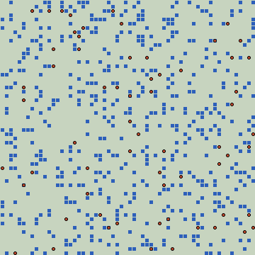

# Predator-Prey Public-Goods Module

This package implements a spatial predator-prey-grass simulation with an
evolving predator hunt-investment trait. The active runtime is
[`emerging_cooperation.py`](./emerging_cooperation.py), and its parameters live
in [`config/emerging_cooperation_config.py`](./config/emerging_cooperation_config.py).

The module is a public-goods style ecology:

- predators pay a private cost for hunt investment
- successful hunts generate a shared benefit
- offspring inherit the hunt-investment trait with mutation
- selection acts through survival, hunting success, and reproduction

This is a current-state README. It describes what the code does now, not the
historical tuning path that produced the present defaults.

## Browser Demo

[](https://doesburg11.github.io/EvolvedCooperation/)

Animated preview of the sampled replay bundle. Click the animation to open the
full GitHub Pages viewer.

## Module Contents

- [`emerging_cooperation.py`](./emerging_cooperation.py)
  Main simulation runtime, tick logic, initialization, diagnostics collection,
  and plotting entrypoint.
- [`config/emerging_cooperation_config.py`](./config/emerging_cooperation_config.py)
  Active configuration module and canonical default parameter set.
- [`utils/matplot_plotting.py`](./utils/matplot_plotting.py)
  Matplotlib plots for populations, trait trajectories, macro energy flow, and
  trait-selection diagnostics.
- [`utils/pygame_renderer.py`](./utils/pygame_renderer.py)
  Live viewer used by the main runtime when the pygame renderer is enabled.
- [`utils/visualize_tick_logic.py`](./utils/visualize_tick_logic.py)
  Writes SVG worked examples of one-tick hunt accounting.
- [`utils/export_github_pages_demo.py`](./utils/export_github_pages_demo.py)
  Exports a sampled replay bundle into the repo-level `docs/` site for GitHub
  Pages.
- [`utils/sweep_dual_parameter.py`](./utils/sweep_dual_parameter.py)
  Two-parameter sweep utility.
- [`utils/tune_mutual_survival.py`](./utils/tune_mutual_survival.py)
  Grid-search style coexistence tuner with checkpointing.
- [`utils/resume_mutual_survival_until_done.py`](./utils/resume_mutual_survival_until_done.py)
  Resume wrapper for the mutual-survival tuner.
- [`utils/compare_high_cooperation_regimes.py`](./utils/compare_high_cooperation_regimes.py)
  Fixed 10000-step comparison of ecology and payoff counterfactuals.
- [`utils/compare_threshold_synergy_regimes.py`](./utils/compare_threshold_synergy_regimes.py)
  Fixed 10000-step comparison focused on the threshold-synergy hunt family.
- [`utils/compare_de_novo_vs_supported_baselines.py`](./utils/compare_de_novo_vs_supported_baselines.py)
  Fixed 2 x 2 comparison of low-start vs supported-start baselines.

## Quick Start

Use the repo-local Python environment from the repository root:

```bash
./.conda/bin/python -m predpreygrass_public_goods.emerging_cooperation
```

Normal workflow:

1. Edit
   [`config/emerging_cooperation_config.py`](./config/emerging_cooperation_config.py).
2. Run the module with the command above.
3. Inspect the live renderer and the Matplotlib figures shown at the end.

Useful notes:

- The main module is package-relative only. Run it with `python -m`, not as a
  loose script.
- The config file is the normal source of truth for the main run.
- Most utilities are configured by editing constants at the top of the utility
  file itself. They do not rely on CLI parameter parsing.
- One exception is
  [`utils/visualize_tick_logic.py`](./utils/visualize_tick_logic.py), which
  also exposes optional output-path arguments for the generated SVG files.

## What The Model Represents

State variables:

- predator i:
  position (x<sub>i</sub>, y<sub>i</sub>), energy E<sub>i</sub>, hunt-investment trait h<sub>i</sub>
- prey j:
  position (x<sub>j</sub>, y<sub>j</sub>), energy P<sub>j</sub>
- grass field:
  per-cell energy G(x, y)

Interpretation:

- h<sub>i</sub> is a continuous inherited trait in [0, 1]
- higher h<sub>i</sub> increases a predator's contribution to coordinated hunting
- higher h<sub>i</sub> also increases its private per-tick cooperation cost

## Initialization

The main run starts from the active config defaults.

Initialization rules:

- predator count is `initial_predator_count`
- prey count is `initial_prey_count`
- each predator starts with energy `initial_predator_energy`
- each predator trait is sampled uniformly from
  `[initial_predator_hunt_investment_trait_min, initial_predator_hunt_investment_trait_max]`
- each prey energy is sampled from a Gaussian with mean
  `initial_prey_energy_mean` and standard deviation
  `initial_prey_energy_stddev`, then clamped to
  `initial_prey_energy_min`
- grass starts as a constant field with value `initial_grass_energy` in every
  cell

The world wraps toroidally:

<p>wrap(v, L) = v mod L</p>

## One Tick Of Simulation

The tick order in [`step_world()`](./emerging_cooperation.py) is:

1. Grass regrows, capped at `max_grass_energy_per_cell`.
2. Each prey may move, pay metabolic and movement costs, eat one grass bite,
   and reproduce.
3. Hunting is resolved from the prey side.
4. Dead prey and hunted prey are removed; newborn prey are appended.
5. Each predator pays metabolic, movement, and cooperation costs, then may
   reproduce and may die from starvation.
6. Diagnostics are written into per-step histories.

Important implementation details:

- movement is in a Moore neighborhood: dx, dy in {-1, 0, 1}
- movement cost uses realized Euclidean distance: &radic;(dx<sup>2</sup> + dy<sup>2</sup>)
- prey reproduction happens before hunting in the same tick
- newborn prey and newborn predators act starting on the next tick
- predators committed to one successful hunt are excluded from further hunts in
  that tick

## Hunt Rules

Common symbols used below:

- h<sub>i</sub>: hunt-investment trait of predator i
- E<sub>i</sub>: current energy of predator i
- C<sub>i</sub> = E<sub>i</sub> &times; h<sub>i</sub>: effective contribution of predator i
- W<sub>g</sub> = sum of all C<sub>i</sub>: total coalition contribution
- S<sub>g</sub> = sum of all h<sub>i</sub>: unweighted sum of predator traits in the hunting group
- P: current prey energy
- p<sub>0</sub>: `base_hunt_success_probability`
- n<sub>g</sub>: number of predators in the hunting group

Candidate detection:

- A prey first looks for nearby predators within `prey_detection_radius`.
- In the threshold-based rules, once engagement is possible, the full coalition
  is pooled from the larger `hunter_pool_radius` neighborhood around the prey.

### `probabilistic`

The smoother rule uses all candidate predators within `prey_detection_radius`
as the hunt group.

Kill probability:

<p>p<sub>kill</sub> = 1 &minus; (1 &minus; p<sub>0</sub>)<sup>S<sub>g</sub> + 1e&minus;6</sup></p>

Interpretation of variables:

- p<sub>0</sub>: baseline success scale
- S<sub>g</sub>: sum of hunt-investment traits, not energy-weighted

This rule does not require an explicit threshold to form a hunt.

### `threshold_synergy` (active default)

This is the current default rule.

Formation conditions:

<p>n<sub>g</sub> &ge; n<sub>min</sub><br>W<sub>g</sub> &ge; P &times; &alpha;<sub>form</sub></p>

If both conditions are met, kill probability is:

<p>p<sub>kill</sub> = p<sub>max</sub> &times; &sigma;(k &times; (W<sub>g</sub> &minus; P &times; &alpha;<sub>exec</sub>))</p>

Where:

- n<sub>min</sub> is `threshold_synergy_min_hunters`
- &alpha;<sub>form</sub> sets the minimum formation effort and is
  `threshold_synergy_formation_energy_factor`
- &alpha;<sub>exec</sub> sets the sigmoid midpoint and is
  `threshold_synergy_execution_energy_factor`
- k controls how sharply success rises near the execution threshold and is
  `threshold_synergy_success_steepness`
- p<sub>max</sub> is the asymptotic ceiling and is
  `threshold_synergy_max_success_probability`
- &sigma;(z) = 1 &divide; (1 + e<sup>&minus;z</sup>)

This rule is meant to model coordinated hunting with a real coalition barrier.

### `energy_threshold`

If W<sub>g</sub> &ge; P, the kill always succeeds. Otherwise it fails.

### `energy_threshold_gate`

This rule first requires W<sub>g</sub> &ge; P, then applies the same probabilistic gate
used in the smoother rule:

<p>p<sub>kill</sub> = 1 &minus; (1 &minus; p<sub>0</sub>)<sup>S<sub>g</sub> + 1e&minus;6</sup></p>

## Reward Sharing And Private Cost

If a hunt succeeds, captured prey energy is distributed to the participating
predators.

Sharing modes:

- equal split:
  each hunter gets P &divide; n<sub>g</sub>
- contribution-weighted split:
  hunter i gets P &times; C<sub>i</sub> &divide; W<sub>g</sub>

The active default is contribution-weighted sharing:

- `share_prey_equally = False`

Private cooperation cost:

<p>cost<sub>i</sub> = c<sub>coop</sub> &times; h<sub>i</sub></p>

where c<sub>coop</sub> is `predator_cooperation_cost_per_unit`.

This cost is charged every predator tick, not only on successful hunts.

That means the module implements an always-on private cost for carrying a high
hunt-investment trait, combined with episodic hunt benefits.

## Reproduction And Mutation

### Prey

Prey reproduce asexually.

Condition:

<p>E<sub>parent</sub> &ge; E<sub>prey,birth</sub> and u &lt; p<sub>prey,birth</sub></p>

Where:

- E<sub>prey,birth</sub> is `prey_reproduction_energy_threshold`
- p<sub>prey,birth</sub> is `prey_reproduction_probability`
- u is a fresh `random()` draw in [0, 1)

Energy transfer:

<p>E<sub>child</sub> = f<sub>prey</sub> &times; E<sub>parent</sub><br>E<sub>parent</sub> = E<sub>parent</sub> &minus; E<sub>child</sub></p>

where f<sub>prey</sub> is `prey_offspring_energy_fraction`.

The child is placed in a nearby cell.

### Predators

Predators also reproduce asexually.

Base condition:

<p>E<sub>parent</sub> &ge; E<sub>pred,birth</sub> and u &lt; p<sub>pred,birth</sub> &times; s<sub>pred,birth</sub></p>

Predator reproduction scale:

<p>s<sub>pred,birth</sub> = max(0, 1 &minus; N<sub>pred</sub> &divide; K<sub>pred</sub>) &times; min(1, N<sub>prey</sub> &divide; N<sub>prey,0</sub>)</p>

Variable meanings:

- N<sub>pred</sub>: current predator count
- N<sub>prey</sub>: current prey count
- K<sub>pred</sub>: `predator_crowding_soft_cap`
- N<sub>prey,0</sub>: `initial_prey_count`
- E<sub>pred,birth</sub>: `predator_reproduction_energy_threshold`
- p<sub>pred,birth</sub>: `predator_reproduction_probability`
- s<sub>pred,birth</sub>: predator reproduction scale

Predator birth mechanics:

- the parent energy is halved
- the child inherits the parent's current trait
- the child is placed within `offspring_birth_radius`
- with probability `cooperation_mutation_probability`, the child trait receives
  Gaussian noise with standard deviation `cooperation_mutation_stddev`
- the mutated trait is clamped back into `[0, 1]`

## Diagnostics Collected During A Run

Population histories:

- predator count per tick
- prey count per tick

Trait histories:

- mean predator hunt-investment trait
- variance of predator hunt-investment trait
- mean trait among hunters in successful multi-hunter kills

Energy-flow histories:

- grass regeneration
- grass to prey transfer
- prey to predator transfer
- predator cooperation cost
- prey and predator decay
- total energy stock and per-step stock change
- invariant residual for the macro energy accounting

Trait-selection histories:

- population mean trait
- population trait quantiles `p10`, `p50`, `p90`
- mean trait among successful hunters
- mean trait among reproducing parents
- mean trait among dead predators
- each of the above minus the population mean

Final-state diagnostic:

- the final distribution of predator traits among survivors

## Plots Shown By The Main Module

The main module uses the plotting helpers in
[`utils/matplot_plotting.py`](./utils/matplot_plotting.py).

Always shown at the end of the run:

- population oscillation plot
- predator-prey phase plot
- mean trait over time
- trait variance over time

Shown only if enabled in the config:

- macro energy-flow figure
- trait-selection diagnostic figure

## Live Renderer

If `enable_live_pygame_renderer=True`, the main run opens a pygame window with:

- the wrapped grid world
- grass intensity by cell
- predator and prey locations
- recent population history
- recent mean hunt-investment-trait history
- current energy and hunt statistics

Controls:

- `Space` or `P`: pause/unpause
- `N` or `Right Arrow`: step once while paused
- `+` or `=`: increase playback speed
- `-`: decrease playback speed
- `0`: reset speed to 30 fps

If the renderer window is closed, the run stops early and is reported as an
interrupted run rather than a full successful horizon.

## Developer API

The most important functions are:

- `resolve_config(overrides=None)`
  Returns a full config dictionary based on `DEFAULT_CONFIG`, with strict
  validation of override keys.
- `step_world(preds, preys, grass, split_stats=None, flow_stats=None, config=None)`
  Advances the ecology by one tick.
- `run_sim(seed_override=None, config=None)`
  Runs the full simulation and returns histories plus final state.
- `main(config=None)`
  Entry point used by `python -m`.

`run_sim()` returns:

1. `pred_hist`
2. `prey_hist`
3. `mean_hunt_investment_trait_hist`
4. `var_hunt_investment_trait_hist`
5. `successful_group_hunt_mean_hunt_investment_trait_hist`
6. `preds_final`
7. `success`
8. `extinction_step`

Meaning of the last two values:

- `success=True` means the run reached the full configured horizon and the live
  renderer was not closed early
- `extinction_step` is the first step at which predators or prey hit zero, or
  `None` if no extinction occurred during the run

For normal use, edit the config file. The optional `config=...` parameters are
mainly there so the analysis utilities can run controlled counterfactuals.

## Active Default Configuration

The current defaults in
[`config/emerging_cooperation_config.py`](./config/emerging_cooperation_config.py)
are:

- grid:
  `grid_width=60`, `grid_height=60`
- initial populations:
  `initial_predator_count=65`, `initial_prey_count=575`
- predator initialization:
  `initial_predator_energy=3.0`,
  `initial_predator_hunt_investment_trait_min=0.0`,
  `initial_predator_hunt_investment_trait_max=0.15`
- run horizon:
  `simulation_steps=10000`
- predator energetics:
  `predator_metabolic_cost=0.053`,
  `predator_move_cost_per_unit=0.008`,
  `predator_cooperation_cost_per_unit=0.02`
- predator reproduction:
  `predator_reproduction_energy_threshold=4.8`,
  `predator_reproduction_probability=0.025`,
  `predator_crowding_soft_cap=800`
- inheritance:
  `cooperation_mutation_probability=0.12`,
  `cooperation_mutation_stddev=0.16`,
  `offspring_birth_radius=1`
- hunt mechanism:
  `prey_detection_radius=1`,
  `hunt_success_rule="threshold_synergy"`,
  `base_hunt_success_probability=0.60`,
  `hunter_pool_radius=2`,
  `threshold_synergy_min_hunters=2`,
  `threshold_synergy_formation_energy_factor=0.5`,
  `threshold_synergy_execution_energy_factor=0.8`,
  `threshold_synergy_success_steepness=1.0`,
  `threshold_synergy_max_success_probability=0.95`,
  `share_prey_equally=False`
- prey:
  `prey_move_probability=0.30`,
  `prey_reproduction_probability=0.082`,
  `initial_prey_energy_mean=1.1`,
  `initial_prey_energy_stddev=0.25`,
  `initial_prey_energy_min=0.10`,
  `prey_metabolic_cost=0.05`,
  `prey_move_cost_per_unit=0.01`,
  `prey_reproduction_energy_threshold=2.0`,
  `prey_offspring_energy_fraction=0.42`,
  `prey_grass_intake_per_step=0.24`
- grass:
  `initial_grass_energy=0.8`,
  `max_grass_energy_per_cell=3.0`,
  `grass_regrowth_per_step=0.055`
- diagnostics:
  `plot_macro_energy_flows=True`,
  `plot_trait_selection_diagnostics=True`,
  `log_reward_sharing=False`,
  `log_energy_accounting=False`,
  `energy_log_interval_steps=1`,
  `energy_invariant_tolerance=1e-6`
- live viewer:
  `enable_live_pygame_renderer=True`,
  `live_render_frames_per_second=30`,
  `live_render_cell_size=14`
- reproducibility:
  `random_seed=0`,
  `restart_after_extinction=False`,
  `max_restart_attempts=60`

Interpretation of the active baseline:

- it is a threshold-synergy supported-start baseline
- it is not a de novo near-zero low-start baseline
- it uses contribution-weighted hunt rewards

## Utility Scripts

All utility modules should be run from the repository root with
`./.conda/bin/python -m ...`.

### Parameter search and tuning

- [`utils/sweep_dual_parameter.py`](./utils/sweep_dual_parameter.py)
  Two-parameter sweep with optional adaptive refinement, heatmaps, and CSV
  outputs.
- [`utils/tune_mutual_survival.py`](./utils/tune_mutual_survival.py)
  Parameter-grid search that ranks candidates by coexistence-style criteria and
  writes checkpoints plus summary CSV output.
- [`utils/resume_mutual_survival_until_done.py`](./utils/resume_mutual_survival_until_done.py)
  Resume wrapper for completing a checkpointed tuning run.

### Fixed comparison experiments

- [`utils/compare_high_cooperation_regimes.py`](./utils/compare_high_cooperation_regimes.py)
  Compares coexistence vs high-trait counterfactuals.
- [`utils/compare_threshold_synergy_regimes.py`](./utils/compare_threshold_synergy_regimes.py)
  Compares threshold-synergy support and counterfactual payoff structures.
- [`utils/compare_de_novo_vs_supported_baselines.py`](./utils/compare_de_novo_vs_supported_baselines.py)
  Separates de novo low-start emergence from scaffolded threshold-synergy
  emergence in a 2 x 2 matrix.

### Explanation and visualization helpers

- [`utils/visualize_tick_logic.py`](./utils/visualize_tick_logic.py)
  Writes two SVG files explaining the one-tick accounting logic to
  `assets/predprey_public_goods/`.
- [`utils/export_github_pages_demo.py`](./utils/export_github_pages_demo.py)
  Runs the active model headlessly and writes a sampled browser replay bundle to
  `docs/data/public-goods-demo/`.
- [`utils/pygame_renderer.py`](./utils/pygame_renderer.py)
  Helper module used by the main runtime. It is not intended to be run as a
  standalone script.

Utility outputs are written under:

- `predpreygrass_public_goods/images/` for CSV and text summaries
- `assets/predprey_public_goods/` for the tick-logic SVG assets
- `docs/data/public-goods-demo/` for the GitHub Pages replay bundle
- `assets/predprey_public_goods/public_goods_demo_preview.gif` for the README
  animation preview

## GitHub Pages Replay Demo

The repository now includes a static browser replay demo under the repo-level
`docs/` site.

Main files:

- `/docs/index.html`
  Minimal viewer page with canvas playback controls, current-state stats, and
  two history charts.
- `/docs/app.js`
  Vanilla JavaScript loader and renderer for the exported replay bundle.
- `/docs/style.css`
  Styling for the GitHub Pages demo.
- [`utils/export_github_pages_demo.py`](./utils/export_github_pages_demo.py)
  Export utility that regenerates the sampled replay data.

Replay regeneration workflow:

1. Review the active model parameters in
   [`config/emerging_cooperation_config.py`](./config/emerging_cooperation_config.py).
2. Run the exporter from the repository root:

   ```bash
   ./.conda/bin/python -m predpreygrass_public_goods.utils.export_github_pages_demo
   ```

3. Inspect the generated bundle under `docs/data/public-goods-demo/`:
   `manifest.json`, `summary.json`, and the chunked `frames_XXXX.json` files.
4. Inspect the regenerated preview animation at
   `assets/predprey_public_goods/public_goods_demo_preview.gif`.
5. Open `docs/index.html` through a local HTTP server for a quick smoke test,
   or publish the repo's `/docs` directory through GitHub Pages.

Important implementation details:

- the browser viewer replays exported states; it does not rerun the Python
  model in JavaScript
- the exporter samples the run every fixed number of simulation steps to keep
  the static payload size manageable
- the exporter also writes a reduced animated GIF preview for GitHub README
  embedding
- exporter parameters such as sample spacing and frame chunk size are defined as
  constants at the top of
  [`utils/export_github_pages_demo.py`](./utils/export_github_pages_demo.py),
  not passed through CLI parsing

## Limitations And Scope

This module is intentionally simpler than a realistic human hunting model.

Important limitations:

- predator and prey reproduction are single-parent, not sexual
- there is no kin structure or kin cue
- there is no memory, planning, or learning
- cooperation is represented by one scalar inherited trait
- predators pay cooperation cost every tick, not only when a hunt forms
- the public-good mechanism is local and short-horizon; there is no explicit
  sharing network beyond the immediate kill event

That makes the module suitable for studying eco-evolutionary feedback around a
continuous cooperative hunting trait, but not for claiming a full model of
human social evolution.
