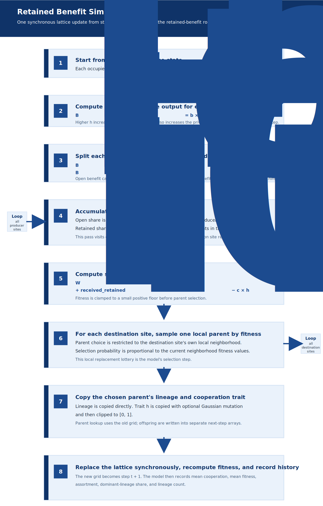

# Retained Benefit Model

This package adds an abstract fourth cooperation model to
`EvolvedCooperation`. Rather than modeling a specific mechanism family such as
altruism, reciprocity, or cooperative hunting, it evaluates a more general
condition:

> cooperation evolves when enough of the benefit created by cooperation flows
> back to cooperators, or to copies of the cooperative rule, to outweigh the
> private cost

The model therefore treats **benefit routing** as its primary variable.

The repo now also contains `retained_kernel/`, which makes the same mechanism
explicit as a separate general module. `retained_benefit/` remains the
website-facing named presentation of that mechanism family.

## Purpose

The other website-facing modules each center a specific mechanism family:

- `spatial_altruism/` focuses on local altruist benefit, private cost, and
  lattice replacement under void pressure and disturbance
- `spatial_prisoners_dilemma/` focuses on repeated local reciprocity and
  strategy competition
- `cooperative_hunting/` focuses on ecological synergy in predator group hunts

These models are strong mechanism studies, but they are less suitable for the
broader question:

> under what general conditions can cooperation spread at all?

This module addresses that question more directly by minimizing
mechanism-specific structure and focusing on one abstract issue:

> how much of the value created by cooperation is retained by cooperators or
> their copies, rather than leaking to free-riders?

## Module Scope

This module provides:

1. A package, `retained_benefit/`, with the main entry point
   `retained_benefit_model.py`.
2. A config-backed runtime in `config/retained_benefit_config.py`, with the
   config file as the primary source of truth.
3. A synchronous lattice simulation in which each site carries:
   - one inherited cooperation trait `h in [0, 1]`
   - one inherited lineage label
4. A benefit-routing rule that splits cooperative output into:
   - an **open** share distributed across the full local neighborhood
   - a **retained** share distributed only among local agents with the same
     lineage as the producer
5. A local replacement rule in which each site copies one local parent with
   probability proportional to fitness.
6. Mutation on the cooperation trait, allowing continuous evolution rather than
   fixed discrete strategies.
7. A live Pygame grid viewer in `retained_benefit_pygame_ui.py` for stepwise
   inspection of spatial dynamics.
8. A frozen website-demo config plus replay exporter, providing a browser-facing
   sampled replay pipeline.
9. JSON logging plus a Matplotlib summary utility for headless experiments and
   post-run inspection.

This design preserves **inheritance**, **local interaction**, **cost**, and
**selection** while removing most mechanism-specific structure. It therefore
provides a relatively direct test of the statement:

> no cooperation without feedback

## Core Representation

Each lattice site is occupied by one agent. Each agent carries:

- `h`: a continuous cooperation trait in `[0, 1]`
- `lineage_id`: an inherited lineage label copied under local reproduction

Interpretation:

- higher `h` means the agent produces more cooperative value
- higher `h` also means the agent pays a larger private cost
- `lineage_id` is not intended as a full biological kin model; it functions as
  an abstract stand-in for copies of the same rule or the same inherited local
  cluster

The module therefore studies cooperation under **local copying plus benefit
retention**, not under learning, planning, contracts, or explicit game memory.

## Benefit Routing Rule

At each step, agent <code>i</code> with cooperation trait
<code>h<sub>i</sub></code> produces gross cooperative output:

<p><code>B<sub>i</sub> = b &times; h<sub>i</sub></code></p>

That output is split into retained and open components:

<p><code>B<sub>i</sub><sup>retained</sup> = r &times; B<sub>i</sub></code></p>
<p><code>B<sub>i</sub><sup>open</sup> = (1 - r) &times; B<sub>i</sub></code></p>

Here <code>B<sub>i</sub><sup>retained</sup></code> is the retained amount produced by site <code>i</code> before routing, not the accumulated retained benefit that site <code>i</code> eventually receives.

The producer also pays a private cost:

<p><code>C<sub>i</sub> = c &times; h<sub>i</sub></code></p>

Fitness is then computed as:

<p><code>W<sub>i</sub> = w<sub>0</sub> + received_open<sub>i</sub> + received_retained<sub>i</sub> - C<sub>i</sub></code></p>

Variable definitions:

- <code>h<sub>i</sub></code>: cooperation trait of agent <code>i</code>
- <code>B<sub>i</sub></code>: total cooperative value generated by agent
  <code>i</code>
- `b`: `cooperation_benefit`
- `r`: `retained_benefit_fraction`
- <code>C<sub>i</sub></code>: private cooperation cost paid by agent
  <code>i</code>
- `c`: `cooperation_cost`
- <code>W<sub>i</sub></code>: resulting fitness used in the replacement step
- <code>w<sub>0</sub></code>: fixed `base_fitness`, added each step as a
  background term that dampens selection intensity
- <code>received_open<sub>i</sub></code>: open benefit received by agent
  <code>i</code> from its neighborhood
- <code>received_retained<sub>i</sub></code>: accumulated retained benefit
  received by agent <code>i</code> from same-lineage producers in its
  neighborhood, not the producer-side term
  <code>B<sub>i</sub><sup>retained</sup></code>

Distribution rule:

- the **open** component is shared equally across the full local neighborhood
- the **retained** component is shared only across same-lineage recipients in
  that local neighborhood and contributes to each recipient site's
  accumulated retained benefit <code>received_retained<sub>i</sub></code>

The central question is therefore not framed as "altruism versus selfishness"
or "tit-for-tat versus defect." It is framed as **how much of cooperation's
return is protected from leakage**.

## Simulation Step

One full synchronous retained-benefit update is shown below.

<figure style="margin: 0 0 1.25rem 0; text-align: center;">
  
  <figcaption><strong>Display 1:</strong> One synchronous retained-benefit update from step <code>t</code> to step <code>t + 1</code>.</figcaption>
</figure>

Turnover is therefore implemented as a **local replacement lottery** rather
than as explicit death, birth, and movement.

## Relation To The Other Models

This model is not intended to be more realistic than the other models. It is
intended to be more **abstract**.

Relative to the other website-facing modules:

- compared with `spatial_altruism/`, this model keeps local inheritance and
  spatial selection but replaces altruist-versus-selfish patch states with a
  continuous cooperation trait and an explicit routing split
- compared with `spatial_prisoners_dilemma/`, this model removes reciprocity
  memory and discrete strategy families so the benefit-feedback structure is
  easier to isolate
- compared with `cooperative_hunting/`, this model removes prey, grass, and
  coalition mechanics so cooperative synergy is reduced to an abstract routing
  problem

This makes the central dependency explicit in one parameter:
`retained_benefit_fraction`.

The model is therefore useful for testing the proposition that cooperation
increases when the retained share of cooperative benefit becomes large enough
relative to the private cost.

## Key Parameters

The most important parameters are:

- `retained_benefit_fraction`
  Main abstraction control. Higher values mean more cooperative value is
  protected from leakage to unrelated local recipients.
- `cooperation_benefit`
  Scales how much value a unit of cooperation creates.
- `cooperation_cost`
  Scales how much private burden cooperation imposes on the producer.
- `mutation_rate` and `mutation_stddev`
  Control how quickly the cooperation trait explores the trait space.
- `initial_lineage_block_size`
  Controls how patchy the initial local lineage structure is.

For a compact parameter sweep, the most informative starting point is:

1. `retained_benefit_fraction`
2. `cooperation_benefit`
3. `cooperation_cost`

This sweep gives the clearest map of where cooperation collapses, coexists, or
increases.

## Package Contents

- `retained_benefit_model.py`
  Main runtime, benefit-routing logic, replacement step, logging, and module
  entry point.
- `retained_benefit_pygame_ui.py`
  Live Pygame viewer for the lattice. It can display either cooperation
  intensity or inherited lineage structure.
- `config/retained_benefit_config.py`
  Active runtime configuration and primary source of truth for the run.
- `config/retained_benefit_website_demo_config.py`
  Frozen configuration used by the website replay export.
- `utils/matplot_plotting.py`
  Matplotlib summary figure for completed runs.
- `utils/export_github_pages_demo.py`
  Website replay exporter for the sampled static JSON bundle.

## Quick Start

Run from the repository root:

```bash
./.conda/bin/python -m retained_benefit.retained_benefit_model
```

For the live grid viewer:

```bash
./.conda/bin/python -m retained_benefit.retained_benefit_pygame_ui
```

To regenerate the website replay bundle from the frozen public config:

```bash
./.conda/bin/python -m retained_benefit.utils.export_github_pages_demo
```

Normal workflow:

1. Edit `config/retained_benefit_config.py`.
2. Run either the headless model or the Pygame viewer from the repository root.
3. Inspect the terminal summaries, live grid, and optional JSON log.

Viewer controls:

- `Space`: play or pause
- `S` or `Right Arrow`: single step
- `R`: reset
- `V`: toggle between cooperation view and lineage view
- `C`: force cooperation view
- `L`: force lineage view
- `+` / `-`: change playback speed

Default output path:

```text
retained_benefit/data/latest_run.json
```

## Interpretation Of The Default Configuration

The default configuration is not presented as a final scientific claim. It is a
clean demonstration baseline.

It should be interpreted as:

- a test of whether continuous cooperation can increase under one explicit
  benefit-routing rule
- an initial probe of how much retained feedback is required before cooperation
  is no longer dominated by free-rider leakage
- a bridge model between the more specialized modules in this repository

It should not be interpreted as:

- a full kin-selection model
- a full human cooperation model
- a realistic ecology
- a universal proof

## Limitations

Important limitations:

- lineage is represented only by a simple inherited label, not a full kin
  structure
- there is no movement
- there is no learning, planning, or memory
- there are no explicit empty sites
- replacement is fully synchronous and stylized
- retained benefit is routed by lineage identity, which is only one possible
  abstraction of copies of the cooperative rule

The module is therefore useful for studying a compact abstract question about
cooperation, but not for making standalone realism claims.

## Website Replay Integration

This module is integrated into the website replay pipeline in the same general
sense as the other browser-facing models in the repository.

Current replay surfaces:

- repo-level GitHub Pages route:
  `docs/retained-benefit/index.html`
- exported replay bundle:
  `docs/data/retained-benefit-demo/`
- public-site page in the sibling `human-cooperation-site` repository:
  `/evolved-cooperation/retained-benefit/`

The module therefore exists in three aligned forms:

1. canonical Python model
2. live local Pygame viewer
3. sampled browser replay for website use
